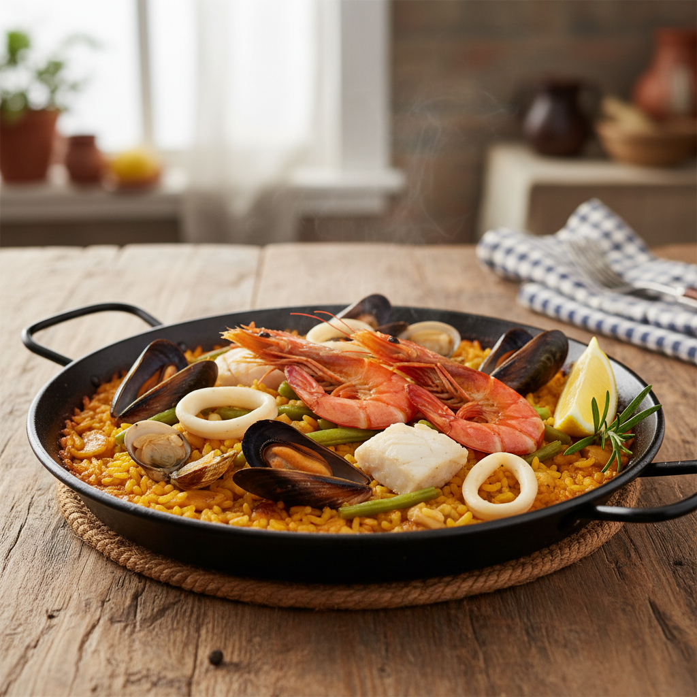

# Paella de Marisco

## Contexto Culinario
Evolución marinera de la paella tradicional valenciana. Requiere dominio del punto de arroz y gestión precisa del fumet para lograr el *socarrat* sin secar el grano. **Receta adaptada para cocción a 2100 msnm (Tlaxcala).**

## Ficha Técnica

| Parámetro | Valor |
|-----------|-------|
| **Tiempo Total** | 50-55 minutos |
| **Dificultad** | Media-Alta |
| **Comensales** | 2 personas |

---

## Ingredientes

### Base Aromática
- 200 g de arroz bomba (varietal D.O. Valencia)
- 580 ml de fumet de pescado (reducido, sin sal) *[Ajustado para altitud]*
- 100 ml de vino blanco seco
- 2 dientes de ajo
- 1 tomate maduro de pera (120 g aprox.)
- 30 ml de aceite de oliva virgen extra
- Azafrán en hebra (8-10 estigmas)
- 1 cucharadita de pimentón dulce de La Vera

### Proteína Marina (Selección Equilibrada)
- 4 gambas rojas (calibre 20/30)
- 4 mejillones
- 4 almejas
- 100 g de sepia o calamar (en anillas)
- 100 g de cazón (dados de 4 cm) *[Sustituto mexicano del rape]*

### Guarnición
- 100 g de judía verde plana (troceada)
- 1 ramita de romero fresco
- Sal Maldon
- Limón (para servir)

---

## Elaboración

**0. Preparación previa del cazón (30 minutos antes):**
   - Cortar en dados de 4 cm.
   - Remojar en agua fría con jugo de 1 limón durante 30 minutos (elimina olor amoniacal).
   - Enjuagar y secar completamente con papel absorbente.

1. **Preparación del fumet:** Calentar el fumet con el azafrán y reservar a temperatura constante (75-80°C). Esto extrae los aromas sin volatilizar.

2. **Sofrito base:** En paellera a fuego medio, calentar el aceite. Dorar los ajos laminados hasta aroma, retirar. Añadir la sepia/calamar, sellar 2 minutos. Reservar.

3. **Construcción aromática:** En el mismo aceite, incorporar el tomate rallado. Cocinar 8 minutos hasta reducción y cambio de color (rojo oscuro). Añadir el pimentón, integrar 10 segundos (sin quemar).

4. **Cocción de arroz (fase crítica):** 
   - Incorporar las judías verdes, saltear 2 minutos.
   - Añadir el arroz, "nacarar" 1 minuto (debe brillar, no dorarse).
   - Verter el vino blanco, evaporar completamente (30 segundos a fuego alto).
   - Incorporar el fumet caliente. **No remover más desde este punto**.

5. **Distribución del marisco:** 
   - Minuto 5: Añadir el cazón y la sepia reservada, distribuyendo uniformemente.
   - Minuto 10: Incorporar gambas, mejillones y almejas presionándolos ligeramente en el arroz.
   - Minuto 12: Clavar la ramita de romero en el centro.

6. **Finalización (24-26 minutos totales a altitud):**
   - Reducir fuego al mínimo últimos 3-4 minutos para formar el *socarrat*.
   - **Control visual crítico:** El arroz debe estar al nivel del líquido. Probar un grano en minuto 22.
   - Si aún está duro, añadir 50 ml de fumet caliente y continuar 3-4 minutos.
   - Retirar del fuego. Cubrir con paño de cocina limpio.
   - Reposar 3 minutos exactos.

---

## Notas del Chef

### Técnica
El "nacarado" del arroz sella el grano y evita que se abra prematuramente. El fumet debe estar siempre caliente antes de añadirse; un choque térmico detiene la gelatinización del almidón. **A 2100 msnm, la relación es arroz:líquido 1:2.9** (el agua hierve a 93°C en lugar de 100°C). La gelatinización del almidón requiere 25-30% más tiempo en altitud.

**Cazón vs Rape:** El cazón (tiburón pequeño) es un excelente sustituto mexicano. Su textura cartilaginosa aguanta cocción prolongada sin deshilacharse. **Crítico:** Siempre desflemar con limón o blanquear para eliminar urea residual (compuesto nitrogenado que genera olor amoniacal en elasmobranquios).

### Punto Crítico
**Remover el arroz después del minuto 4 rompe la estructura del grano y genera una textura pastosa**. La paella se construye por capas, no por mezcla. El socarrat solo se forma con paellera de acero y distribución homogénea del calor en los últimos 3-4 minutos. **En altitud, no confiar únicamente en el tiempo**: la prueba de textura del grano es obligatoria para evitar arroz crudo o pasado.

### Maridaje
**Albariño de Rías Baixas** (12-13% vol., crianza sobre lías). La salinidad del vino complementa el yodo del marisco sin competir. Alternativa: Verdejo joven de Rueda (menos estructura, más fruta).
