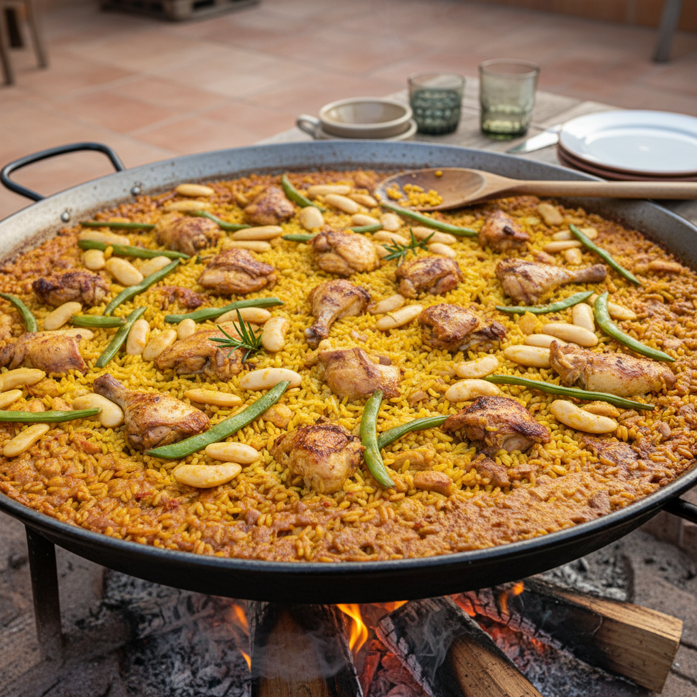

# Paella Valenciana de Conejo y Pollo

La auténtica paella valenciana en su máxima expresión: arroz seco, socarrat crujiente y sabor a leña. Esta receta sigue la tradición de los maestros paelleros de la Albufera. **Receta adaptada para cocción a 2100 msnm (Tlaxcala).**

**Tiempo:** 1h 15 min | **Comensales:** 10 pax

## Ingredientes

### Proteínas
* 1 conejo de 1.2kg (troceado en 20 piezas pequeñas)
* 1 pollo de corral de 1.5kg (troceado en 20 piezas pequeñas)
* 500g de garrofón valenciano (judía blanca grande, fresca o congelada)
* 500g de ferradura o bajoqueta (judía verde plana valenciana)

### Base de Arroz
* 1kg de arroz bomba o senia (variedad valenciana)
* 3.4 litros de agua o caldo de pollo casero *[Ajustado para altitud]*
* 200g de tomate maduro rallado
* 0.5g de hebras de azafrán (o colorante alimentario si no dispones)
* 2 cucharadas soperas de pimentón dulce de La Vera
* 10 caracoles de huerta (opcional pero tradicional)
* 1 ramita de romero fresco
* Aceite de oliva virgen extra (150ml)
* Sal gorda

## Elaboración

### Preparación Previa (Crucial)
1. **Secar las carnes:** Seca muy bien el conejo y el pollo con papel de cocina. La humedad impide que se doren correctamente.
2. **Trocear correctamente:** Piezas pequeñas (4-5cm). En paella valenciana, las piezas pequeñas liberan más sabor y se cocinan uniformemente.
3. **Calentar el agua:** Ten los 3.4 litros de agua hirviendo en una olla aparte. NUNCA se añade agua fría al arroz.

### Cocción en la Paella
**IMPORTANTE:** Usa una paellera de 55-60cm para 10 personas. El arroz debe quedar en capa fina (máximo 1cm de grosor).

4. **Fuego fuerte inicial:** Pon la paellera al fuego fuerte (leña, gas o paellero). Añade el aceite y espera a que humee ligeramente.

5. **Dorar las carnes (10 min):** Dora el conejo y el pollo por tandas, sin amontonar. Deben coger color dorado intenso. Este paso es FUNDAMENTAL para el sabor. No escatimes tiempo aquí. Salar las carnes mientras doran.

6. **Añadir las verduras (5 min):** Con las carnes ya doradas en la paellera, añade el garrofón y la ferradura cortada en trozos de 4cm. Sofreír 3-4 minutos hasta que empiecen a ablandarse.

7. **Sofreír el tomate (5 min):** Añade el tomate rallado y sofríe a fuego fuerte hasta que el agua se evapore y el aceite se separe (punto clave: el tomate debe "fritar", no hervir).

8. **Pimentón y agua (inmediato):** Retira la paella del fuego 10 segundos, añade el pimentón, remueve 5 segundos y RÁPIDAMENTE añade los 3.4 litros de agua hirviendo. El pimentón se quema en segundos y amarga todo el plato. Vuelve al fuego fuerte.

9. **Hervir y reducir (20 min):** Deja hervir a fuego fuerte durante 20 minutos. Añade el azafrán y la ramita de romero. Prueba el caldo y rectifica de sal (debe estar ligeramente salado). El caldo debe reducirse y concentrar su sabor. Retira el romero.

10. **MOMENTO CRÍTICO - Añadir el arroz:** Distribuye el arroz uniformemente por toda la superficie formando una capa fina. USA UNA ESPUMADERA O RASERA PARA NIVELAR, NUNCA REMUEVAS CON CUCHARA. Desde este momento, NO SE TOCA MÁS EL ARROZ.

11. **Cocción del arroz - 3 fases (adaptado a altitud):**
    - **Fase 1 (12 min - Fuego fuerte):** El arroz absorbe caldo burbujeando vigorosamente. Rota la paellera cada 2-3 minutos para cocción uniforme.
    - **Fase 2 (10 min - Fuego medio):** El caldo está casi absorbido, el borboteo se calma. Si ves que falta líquido, añade un poco de agua hirviendo por los bordes (nunca por el centro).
    - **Fase 3 (3-4 min - Fuego fuerte final):** SOCARRAT. Sube el fuego al máximo. Olerás el arroz tostándose en el fondo. Cuando huela a tostado (no quemado) y oigas un ligero chisporroteo, retira del fuego.
    - **Control visual crítico (minuto 20):** Probar un grano del centro. Si aún está duro, añadir 100-150ml de agua hirviendo y continuar 3-4 minutos.

12. **Reposo (5-10 min):** Tapa la paella con un paño de cocina limpio o papel de aluminio. El arroz termina de cocerse con su propio vapor. Este paso es OBLIGATORIO.

## Notas del Chef

* **Truco Maestro - La Proporción Sagrada (Adaptada a Altitud):** A nivel del mar: 1 parte de arroz x 2.5 partes de líquido. **A 2100 msnm: 1 parte de arroz x 3.4 partes de líquido** (el agua hierve a 93°C). Para 1kg de arroz necesitas 3.4L de caldo. La gelatinización del almidón requiere 25-30% más tiempo y líquido en altitud.

* **El Socarrat Perfecto:** Es la capa crujiente del fondo. Se consigue con fuego fuerte los últimos 2-3 minutos. Debe oler a tostado, NO a quemado. Si tu primera paella no tiene socarrat, no te preocupes: es el paso más difícil de dominar.

* **Secreto del Fuego:** La paella valenciana se hace con fuego de leña tradicionalmente. Si usas gas, distribuye el calor uniformemente (paellero con corona circular). Si tienes fuego central, rota la paella constantemente.

* **Textura del Arroz:** Debe quedar "meloso" (húmedo pero no caldoso) en la superficie y seco-crujiente en el fondo. Si queda duro, faltó líquido o tiempo. Si queda pastoso, sobraba líquido o se removió demasiado.

* **Errores Imperdonables que Arruinan la Paella:**
  1. Remover el arroz una vez añadido (lo rompe y queda pastoso)
  2. Añadir agua fría (para la cocción)
  3. Quemar el pimentón (amarga toda la paella)
  4. Capa de arroz gruesa (se cuece mal)
  5. No probar el caldo antes de añadir el arroz (si no está bien de sal, el arroz quedará soso)

* **Ingredientes Prohibidos en la Auténtica Valenciana:** Guisantes, chorizo, pimiento rojo, cebolla. Estos son de otras regiones pero NO de la paella valenciana tradicional.

* **Test del Maestro Paellero:** Clava un palillo en el centro de la paella. Si sale limpio y el arroz está en su punto (ni duro ni pastoso), está lista.

* **Adaptación para menos comensales (Altitud):** Para 4 personas = 500g arroz + 1.7L caldo. Para 6 personas = 700g arroz + 2.4L caldo. Siempre mantener proporción 1:3.4 a 2100 msnm.

* **Maridaje:** Agua fresca, cerveza bien fría, o un vino rosado valenciano tipo Bobal. Los valencianos tradicionales no beben vino con paella, sino agua o cerveza.

* **Conservación:** La paella se come recién hecha. No aguanta bien la nevera porque el arroz se endurece. Si sobra, mejor hacer arancini (croquetas de arroz) al día siguiente.
