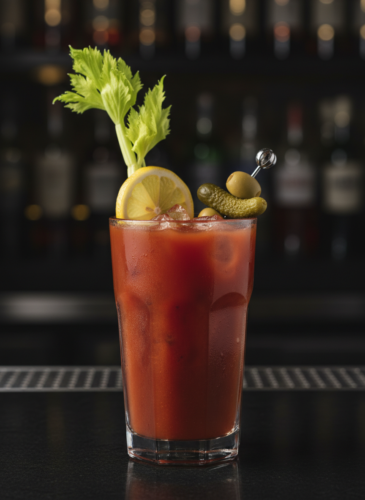

# Bloody Mary

Cóctel icónico estadounidense de los años 20, conocido como el "rey de los brunch". Combinación sabrosa de vodka, tomate y especias con perfil umami intenso y carácter revitalizante.

| Tiempo Total | Dificultad | Porciones |
| :--- | :--- | :--- |
| 8 min | Media | 1 |

## Ingredientes

* 60 ml Vodka (preferiblemente neutro como Absolut o Grey Goose)
* 120 ml Jugo de tomate fresco o de calidad premium
* 15 ml Jugo de limón recién exprimido
* 2-3 gotas Salsa Worcestershire
* 2-4 gotas Salsa Tabasco (ajustar según tolerancia)
* 1 pizca Sal de apio
* 1 pizca Pimienta negra recién molida
* 1 pizca Pimentón ahumado (opcional)
* Hielo en cubos
* 1 tallo Apio con hojas
* 1 rodaja Limón
* Opcional: aceitunas, pepinillos, camarones, tocino

## Elaboración

1. **Preparación del vaso:** Usar un vaso highball (tipo collins) alto y preparar el rimado opcional con mezcla de sal, pimienta y pimentón en un platillo. Humedecer el borde con limón y pasar por la mezcla.

2. **Construcción (Built):** Llenar el vaso con hielo hasta 3/4 de su capacidad.

3. **Mezclado de base:** En una coctelera o directamente en el vaso, combinar el jugo de tomate, jugo de limón, Worcestershire, Tabasco y especias. Si usas coctelera, agita suavemente sin hielo para integrar (no queremos espuma).

4. **Ensamblaje:** Verter el vodka sobre el hielo en el vaso. Añadir la mezcla de tomate y especias.

5. **Integración final:** Usar una cuchara de bar larga para mezclar suavemente de abajo hacia arriba (rolling technique) 3-4 veces. El objetivo es integrar sin emulsionar.

6. **Garnish elaborado:** Insertar el tallo de apio como "cuchara comestible". Añadir la rodaja de limón en el borde. Si deseas, crear un skewer con aceitunas, pepinillos y otros elementos.

7. **Servicio:** Presentar con pajilla/popote y servilleta. El cóctel debe verse "cargado" y apetitoso.

## Notas del Bartender

* **Método:** La técnica es "Built" (construido directamente en el vaso). NO se agita violentamente con hielo para evitar dilución excesiva y pérdida de la textura viscosa del tomate.

* **Balance:** El equilibrio entre umami (tomate, Worcestershire), acidez (limón), picante (Tabasco) y salinidad es crítico. Prueba antes de servir y ajusta.

* **Hielo y Dilución:** Hielo en cubos grandes. El Bloody Mary tolera cierta dilución que ayuda a integrar sabores, pero no debe ser acuoso.

* **Ingredientes críticos:** La calidad del jugo de tomate es fundamental. Evita jugos con exceso de sodio o sabores artificiales. El vodka debe ser neutro y limpio, no con sabores.

* **Cristalería y Garnish:** Vaso highball de 350-400ml. El garnish es espectacular y funcional - el apio añade frescura y crunch, y sirve para remover. Las variaciones con camarones, tocino o incluso sliders son comunes en brunch.

* **Timing:** Es un cóctel de consumo relativamente rápido por el hielo. Servir inmediatamente después de preparar.

* **Variaciones:** 
  - **Red Snapper:** Sustituir vodka por gin
  - **Bloody Maria:** Sustituir vodka por tequila
  - **Bloody Caesar:** Añadir clamato en lugar de solo jugo de tomate
  - **Virgin Mary:** Versión sin alcohol

* **Historia:** Origen disputado entre París (Harry's New York Bar, Fernand Petiot, 1921) y Nueva York. El nombre supuestamente deriva de la Reina María I de Inglaterra o de una camarera llamada Mary.

* **Contexto de consumo:** Clásico de brunch y desayuno. Tradicionalmente considerado un "hair of the dog" (remedio para la resaca) por su contenido de vitaminas y especias estimulantes.
