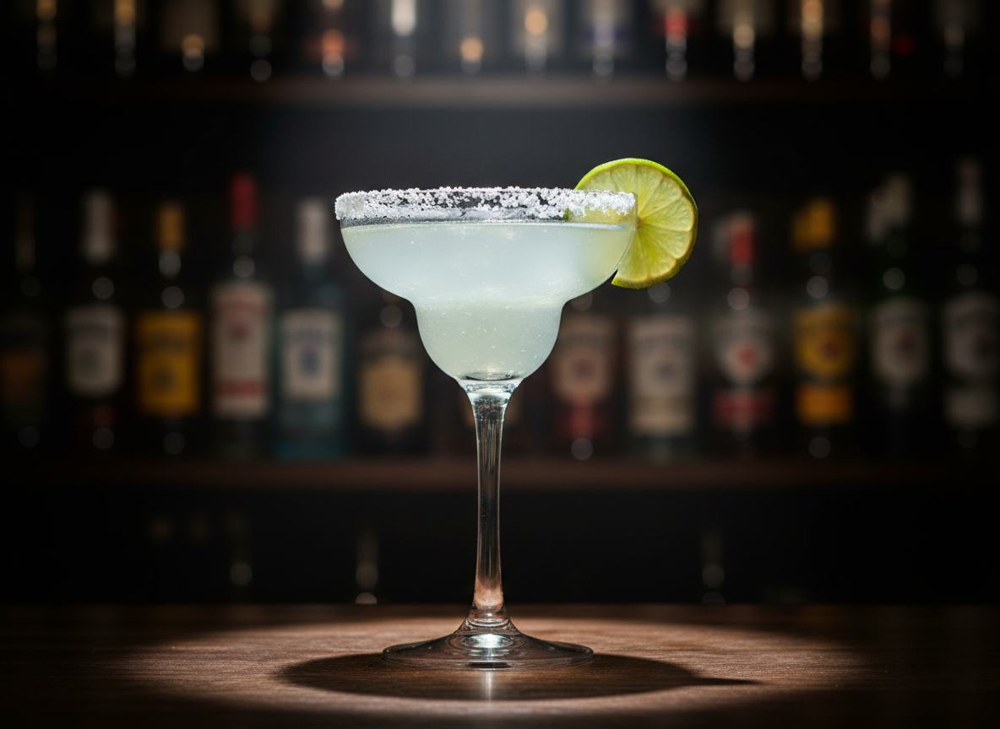

# Margarita

Cóctel mexicano icónico que representa el perfecto balance entre dulce, ácido y amargo. Perfil de sabor: cítrico, refrescante, con notas agaves del tequila y el toque amargo del triple sec. Origen disputado entre Tijuana (1938) y Ciudad Juárez (1942), pero universalmente reconocido como el rey de los cócteles mexicanos.

| Tiempo | Dificultad | Raciones |
| :--- | :--- | :--- |
| 5 min | Media | 1 copa |

## Ingredientes

* 50 ml Tequila blanco 100% agave (recomendado: Patrón Silver, Don Julio Blanco)
* 25 ml Cointreau o Triple Sec de calidad
* 25 ml Jugo de lima fresco (aprox. 1-1.5 limas)
* 1 cucharada Sal de mar gruesa (para borde de copa)
* 1 rodaja Lima fresca (garnish)
* Cubos de hielo (suficiente para shaker y copa)

## Preparación

1. **Preparar la copa:** Frotar el borde de una copa Margarita o coupette con una rodaja de lima. Invertir la copa sobre un plato con sal gruesa para crear el borde escarchado. Reservar en congelador.
2. **Exprimir las limas:** Exprimir limas frescas justo antes de preparar. El jugo fresco es crítico para el perfil ácido correcto.
3. **Shaken:** En una coctelera (shaker), combinar tequila, Cointreau y jugo de lima fresco. Llenar 2/3 del shaker con hielo en cubos.
4. **Agitar con vigor:** Agitar enérgicamente durante 10-15 segundos hasta que el exterior del shaker esté escarchado y frío al tacto. Esto crea la dilución y temperatura óptimas (~-5°C).
5. **Strain doble:** Colar a través del strainer del shaker + fine strainer (colador fino) para eliminar cristales de hielo y pulpa de lima.
6. **Servir:** Verter en la copa preparada. Decorar con una rodaja o rueda de lima en el borde.

## Notas del Bartender

* **Método - Shaken, not Stirred:** La Margarita DEBE ser agitada (shaken) para crear la emulsión correcta entre el jugo cítrico y el alcohol, además de lograr la dilución y aireación necesarias. Nunca se remueve (stirred).
* **Hielo y Dilución:** La dilución controlada durante el shaking (aprox. 20-25% del volumen final) es esencial. Un shaking insuficiente resulta en un cóctel muy alcohólico y agresivo. Sobre-shaking diluye excesivamente y pierde cuerpo.
* **Cristalería y Garnish:** Copa Margarita tradicional (12-14 oz) o coupette (6-8 oz) pre-enfriada. El borde de sal debe cubrir solo la mitad externa del borde para permitir al cliente elegir el nivel de salinidad en cada sorbo. Alternativa: servir "on the rocks" en vaso Old Fashioned con hielo fresco.
* **Balance de Sabor:** Ratio clásico 2:1:1 (tequila:cointreau:lima). Ajustar acidez según la lima - las limas muy maduras pueden requerir reducir 5ml del jugo. Para versión más dulce, añadir 10ml de jarabe simple (1:1).
* **Tequila Quality Matters:** Usar exclusivamente tequila 100% agave. Los tequilas mixtos arruinan el perfil de sabor. El blanco/silver mantiene las notas agaves frescas; el reposado añade complejidad con notas de barrica.
* **Variaciones Clásicas:**
  * **Tommy's Margarita:** Sustituir Cointreau por 15ml de jarabe de agave, aumentar tequila a 60ml.
  * **Frozen Margarita:** Licuar todos los ingredientes con 1.5 tazas de hielo picado hasta consistencia de granizado.
  * **Spicy Margarita:** Añadir 2-3 rodajas de jalapeño al shaker antes de agitar.
* **Error Común:** Usar jugo de lima embotellado o limón amarillo. La lima fresca (lime, no lemon) es absolutamente no negociable para el perfil ácido correcto.
