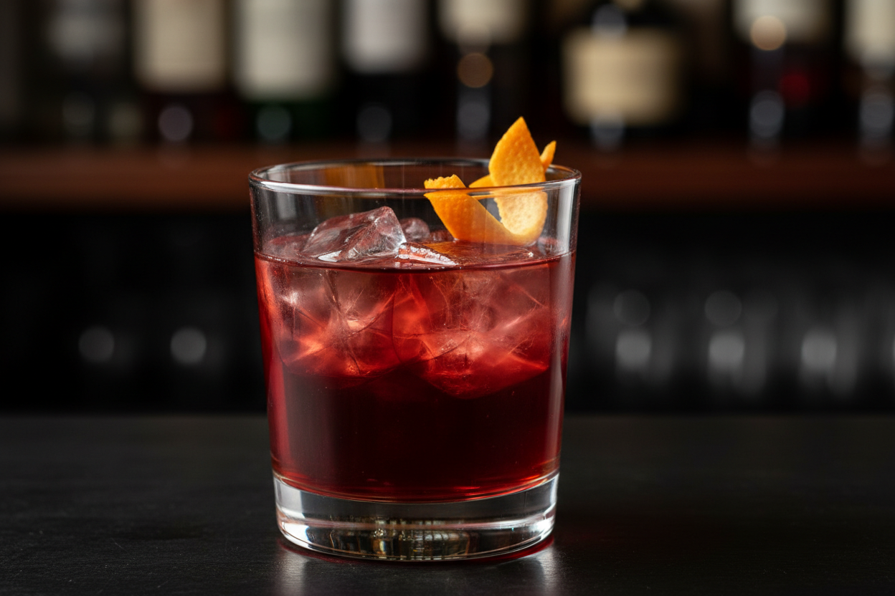

# Negroni

Cóctel italiano clásico creado en Florencia en 1919, equilibrio perfecto entre amargor, dulzor y fuerza alcohólica.

| Tiempo Total | Dificultad | Porciones |
| :--- | :--- | :--- |
| 5 min | Baja | 1 |

## Ingredientes

* 30 ml Gin
* 30 ml Campari
* 30 ml Vermut rojo italiano (Martini Rosso o Carpano Antica)
* Hielo en cubos grandes
* 1 rodaja Media naranja
* 1 twist Piel de naranja

## Elaboración

1. **Preparación del vaso:** Llenar un vaso Old Fashioned (vaso bajo) con hielos grandes y dejar enfriar mientras se preparan los ingredientes.
2. **Mezcla:** Retirar el exceso de agua derretida del vaso. Verter directamente sobre el hielo el gin, Campari y vermut rojo en proporciones exactamente iguales (1:1:1).
3. **Integración:** Remover suavemente con cuchara de bar durante 15-20 segundos en sentido circular para integrar los ingredientes sin diluir excesivamente.
4. **Guarnición:** Expresar los aceites esenciales de la piel de naranja sobre la superficie del cóctel doblándola sobre el vaso, frotar el borde del vaso con la piel y depositarla dentro. Añadir media rodaja de naranja.
5. **Servicio:** Servir inmediatamente en el mismo vaso.

> **Notas del Chef:**
> * **Técnica:** La proporción 1:1:1 es sagrada en el Negroni. La cuchara de bar debe moverse lentamente para no romper el hielo y sobre-diluir el cóctel.
> * **Punto Crítico:** El hielo debe ser de calidad (grande y cristalino) para evitar dilución rápida. Jamás usar hielo picado.
> * **Ingredientes:** La calidad del gin y vermut marca la diferencia. El Campari no tiene sustituto válido.
> * **Variaciones:** Negroni Sbagliato (sustituir gin por prosecco), Boulevardier (sustituir gin por bourbon).
> * **Maridaje:** Aperitivo perfecto antes de una comida italiana. Excelente con aceitunas, almendras saladas o embutidos.
> * **Historia:** Creado por el Conde Camillo Negroni en el Caffè Casoni de Florencia al pedir que reforzaran su Americano (Campari + vermut + soda) sustituyendo la soda por gin.
