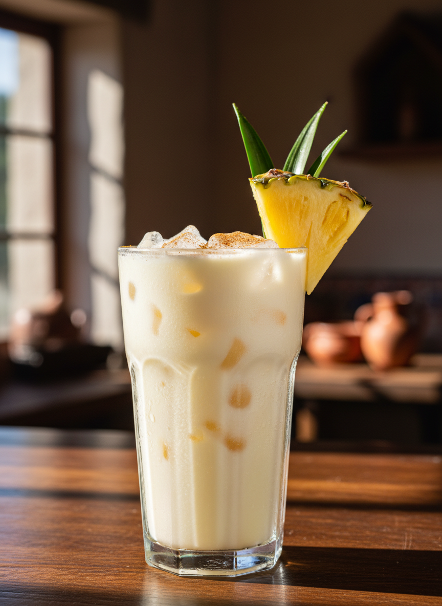

# Piñada

Bebida cremosa tradicional del centro de México, especialmente popular en Tlaxcala, Puebla y Morelos. Combina la dulzura tropical de la piña fresca con la suavidad láctea en un balance perfecto. Refrescante, nutritiva y con carácter festivo ideal para comidas familiares.

| Tiempo Total | Dificultad | Porciones |
| :--- | :--- | :--- |
| 15 min | Baja | 4 vasos |

## Ingredientes

* 400 g Piña fresca pelada y cortada en trozos (aproximadamente 1/2 piña mediana)
* 500 ml Leche entera fría
* 100 ml Leche condensada (ajustar al gusto)
* 1 cucharadita Extracto de vainilla
* 1 pizca Canela en polvo (opcional)
* 500 g Hielo en cubos (para licuado o servicio)
* Azúcar al gusto (opcional, dependiendo de dulzor de la piña)

## Preparación

1. **Selección de piña:** Elegir piña madura pero firme, de color amarillo dorado y aroma dulce en la base. Pelar completamente eliminando todos los "ojos" y cortar en trozos medianos.

2. **Pre-enfriamiento:** Asegurar que todos los ingredientes lácteos estén bien fríos (refrigerador mínimo 2 horas). Esto es crítico para la temperatura final y textura.

3. **Licuado base:** En licuadora de alta potencia, agregar los trozos de piña con 250 ml de leche entera. Licuar a velocidad máxima durante 45-60 segundos hasta obtener consistencia completamente líquida sin grumos.

4. **Integración láctea:** Con la licuadora en velocidad media, añadir gradualmente el resto de la leche entera (250 ml), la leche condensada y el extracto de vainilla. Licuar 30 segundos más.

5. **Ajuste de dulzor:** Probar y ajustar con leche condensada adicional o azúcar según preferencia. La piñada debe ser dulce pero permitiendo que la acidez natural de la piña brille.

6. **Método de hielo (Elección A - Licuado Frappé):** Agregar 300 g de hielo a la licuadora y pulsar hasta textura semi-granizada. Resultado: bebida espesa, cremosa, tipo smoothie.

7. **Método de hielo (Elección B - Servicio Tradicional):** Colar la mezcla con colador fino para eliminar fibra residual. Servir sobre hielo en cubos grandes en vasos highball. Resultado: bebida líquida, elegante, menos densa.

8. **Garnish:** Espolvorear canela en polvo sobre la superficie. Decorar con cuña de piña fresca en el borde del vaso y opcionalmente una hoja de piña como elemento decorativo.

9. **Servicio inmediato:** Servir con pajilla/popote grueso (si es frappé) o pajilla estándar. Remover antes de beber para reintegrar si hay separación.

## Notas del Bartender

* **Método:** Esta bebida es "Built & Blended" - construcción directa en licuadora con integración de todos los componentes. NO se agita ni se remueve manualmente.

* **Balance Lácteo-Frutal:** El ratio ideal es aproximadamente 2.5:1 (piña:lácteos totales en volumen). Demasiado lácteo mata la frescura tropical; demasiada piña puede cuajar la leche por acidez.

* **Emulsión y Estabilidad:** La bromelina (enzima de la piña) tiende a romper proteínas lácteas causando separación. Soluciones:
  - Usar leche muy fría (ralentiza reacción enzimática)
  - Servir inmediatamente después de preparar
  - La leche condensada ayuda a estabilizar por su mayor contenido de azúcar
  - Opcional: 1 cucharadita de lecitina de soya como emulsionante natural

* **Colado Crítico:** Usar colador de malla fina o colador de leche vegetal. La fibra residual de piña arruina la textura sedosa característica.

* **Cristalería:** Vaso highball (350-400 ml) o vaso Collins para servicio tradicional. Tarro mason jar para presentación rústica-mexicana. Copa hurricane para servicio festivo.

* **Temperatura de Servicio:** 4-6°C es ideal. Si usas método frappé, temperatura final será 0-2°C (semi-congelada).

* **Variaciones Regionales:**
  - **Piñada de Coco:** Sustituir 200 ml de leche por leche de coco (más tropical, estilo piña colada virgen)
  - **Piñada Especiada:** Agregar 1/4 cucharadita de cardamomo + jengibre fresco rallado
  - **Piñada con Avena:** Añadir 30g avena remojada (más nutritiva, textura más densa)

* **Maridaje:** Perfecta con comida picante (el lácteo calma capsaicina), tacos al pastor, carnitas, mole, barbacoa. También como postre líquido con pan dulce o galletas.

* **Timing y Batch:** NO es batch-friendly. Preparar máximo 2 horas antes y mantener refrigerado revolviendo cada 30 min. Ideal es preparación a la orden.

* **Alcohol Optional (Adultos):** Para versión con alcohol, añadir 50 ml de ron blanco o tequila reposado por vaso = "Piñada Loca" o "Coco Loco de Piña".

* **Historia y Contexto:** Aunque no tiene un origen documentado preciso, la piñada es parte de la familia de "aguas preparadas" o "aguas frescas cremosas" del centro de México. En Tlaxcala y Puebla es tradicionalmente servida en fondas, mercados y celebraciones familiares, especialmente en clima cálido. Es la versión mexicana-mestiza de bebidas tropicales, combinando la piña (prehispánica) con lácteos (europea) en una síntesis cultural única.

* **Tip Profesional:** Si la piña está muy ácida, añadir 1 cucharada de azúcar Y aumentar ligeramente la leche condensada. Si está muy dulce, agregar jugo de 1/2 limón para balance.
