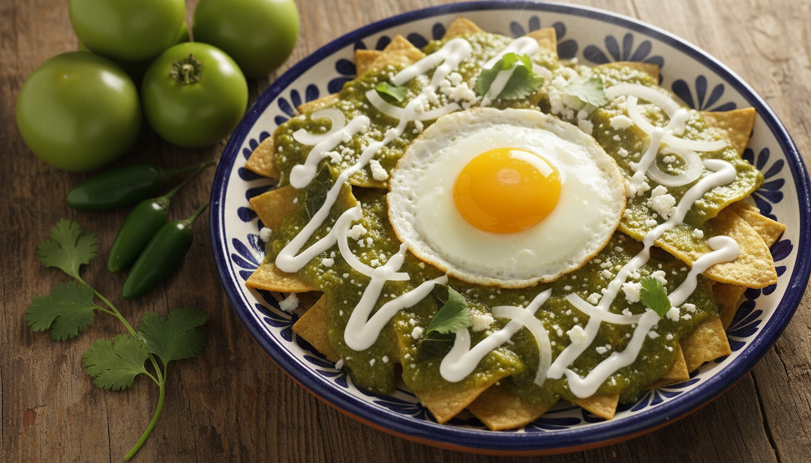

# Chilaquiles Verdes del Centro de México

Desayuno emblemático del centro de México donde el equilibrio entre salsa, totopos y tiempo de mezcla define la textura ideal. El epazote es esencial en la salsa verde.

## Ficha Técnica

| Tiempo | Dificultad | Comensales |
|--------|------------|------------|
| 35 min | Media | 4 |

## Ingredientes

### Totopos
* 12 tortillas de maíz (día anterior, ligeramente secas)
* 500 ml aceite vegetal para freír
* Sal al gusto

### Salsa Verde
* 500 g tomatillos verdes
* 2 chiles serranos
* 1 diente de ajo
* 1/4 cebolla blanca
* 3 ramas epazote fresco
* 200 ml caldo de pollo
* 2 cucharadas aceite
* Sal al gusto

### Montaje
* 150 g pollo deshebrado cocido (opcional)
* 100 ml crema mexicana
* 80 g queso fresco desmoronado
* 1/2 cebolla blanca en rodajas finas
* Cilantro fresco picado
* 4 huevos (opcional)

## Elaboración

### 1. Preparación de Totopos
1. Cortar cada tortilla en 6-8 triángulos regulares.
2. Calentar aceite a 180°C en sartén profunda.
3. Freír los totopos en tandas hasta que estén completamente dorados y crujientes (3-4 minutos). Importante: deben deshidratarse completamente.
4. Escurrir sobre papel absorbente y salar ligeramente.

### 2. Salsa Verde
5. Retirar cáscaras de los tomatillos y enjuagar.
6. Hervir tomatillos, chiles serranos, ajo y cebolla en agua durante 8-10 minutos hasta suavizar.
7. Escurrir y licuar con el caldo de pollo y las ramas de epazote hasta obtener salsa lisa.
8. En cacerola, calentar 2 cucharadas de aceite a fuego medio-alto.
9. **Freír la salsa** vertiéndola en el aceite caliente (punto crítico). Dejar que hierva y reducir fuego a medio.
10. Cocinar 8-10 minutos hasta que espese ligeramente y cambie a un verde más oscuro.
11. Ajustar sal y consistencia con caldo si es necesario. La salsa debe cubrir pero no ahogar.

### 3. Montaje
12. **Punto crítico de textura:** Agregar los totopos a la salsa caliente justo antes de servir.
13. Mezclar con movimientos envolventes durante 1-2 minutos. Los totopos deben ablandarse ligeramente pero mantener algo de crujiente.
14. Servir inmediatamente en platos individuales.
15. Coronar con pollo deshebrado (si se usa), crema en zigzag, queso desmoronado, rodajas de cebolla y cilantro.
16. Si se desea con huevo, freír o estrellarlo y colocar sobre los chilaquiles.

## Notas del Chef

**Técnica:** La clave está en tres puntos: totopos completamente deshidratados al freír, freír la salsa después de licuar (desarrolla sabor profundo), y mezclar con la salsa justo antes de servir. El epazote es insustituible.

**Punto Crítico:** El tiempo de mezcla determina la textura final. 1-2 minutos máximo para mantener el equilibrio entre crujiente y suave. Chilaquiles "nadando" en salsa son técnicamente incorrectos.

**Maridaje:** Café de olla, agua fresca de jamaica o naranja. En contexto de brunch: michelada preparada. Los chilaquiles son el desayuno anti-resaca por excelencia en México.
