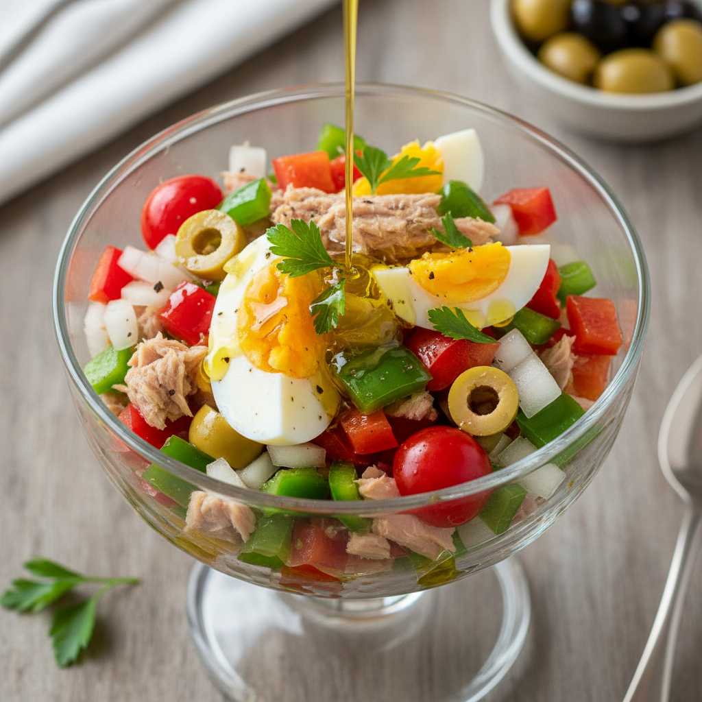

# Salpicón de Atún

El rey del verano español: fresco, ligero y lleno de sabor mediterráneo. Un plato donde la calidad del atún y el corte preciso de las verduras marcan la diferencia.

**Tiempo:** 25 min (más 30 min reposo) | **Comensales:** 4 pax

## Ingredientes

* 400g de atún en aceite de oliva de calidad (escurrido) o atún rojo fresco
* 2 tomates de pera maduros pero firmes
* 1 pimiento verde italiano
* 1 pimiento rojo
* 1 cebolla dulce mediana
* 2 huevos cocidos
* 12 aceitunas verdes sin hueso
* 50ml de aceite de oliva virgen extra
* 25ml de vinagre de Jerez
* Sal en escamas
* Pimienta negra recién molida
* Perejil fresco picado

## Elaboración

1. **Corte en brunoise perfecto:** Pelar y picar la cebolla en dados de 3-4mm. Lavar y cortar los pimientos en brunoise del mismo tamaño, eliminando semillas y nervios blancos. Pelar los tomates (escáldalos 20 segundos si es necesario), retirar las semillas y picarlos también en dados pequeños regulares.

2. **Preparar el atún:** Si usas atún en conserva, escúrrelo bien y desmenuza con las manos en trozos irregulares (nunca picar con cuchillo, pierde textura). Si usas atún fresco, márcalo 30 segundos por lado y córtalo en dados de 1cm.

3. **Cocer los huevos:** Hervir durante 10 minutos exactos, enfriar en agua helada, pelar y picar en cuartos.

4. **Montaje:** En un bol amplio, mezclar suavemente todos los ingredientes picados. Añadir las aceitunas cortadas en rodajas.

5. **Aliño:** En un bol pequeño, emulsionar el aceite con el vinagre, sal y pimienta. Verter sobre el salpicón y mezclar con delicadeza para no romper los ingredientes.

6. **Reposo:** Refrigerar mínimo 30 minutos antes de servir para que los sabores se integren. Rectificar de sal justo antes de emplatar.

7. **Presentación:** Servir en copa de cristal o en molde (usar un aro de emplatar), decorar con perejil fresco y un hilo de aceite de oliva virgen extra.

## Notas del Chef

* **Truco:** El corte en brunoise (dados pequeños y regulares) es FUNDAMENTAL. Un corte irregular hace que unos ingredientes dominen sobre otros en cada bocado.
* **Calidad del atún:** Usa atún de calidad (bonito del norte, ventresca, o atún claro). La diferencia es abismal. Si usas atún fresco tipo tataki, márcalo muy brevemente para que quede crudo por dentro.
* **Punto de sal:** El aliño debe ser generoso pero sin enmascarar el sabor del atún. Prueba antes de servir y ajusta.
* **Errores comunes:** Cortar las verduras demasiado gruesas arruina la textura del plato. Evitar también el exceso de vinagre, que puede "cocer" las verduras y el atún.
* **Variación premium:** Sustituir el atún en conserva por tataki de atún rojo ligeramente marinado. Añadir alcaparras pequeñas para un toque de acidez extra.
* **Maridaje:** Un vino blanco albariño bien frío o una manzanilla de Sanlúcar de Barrameda. Para una opción sin alcohol, una tónica premium con hierbas aromáticas.
