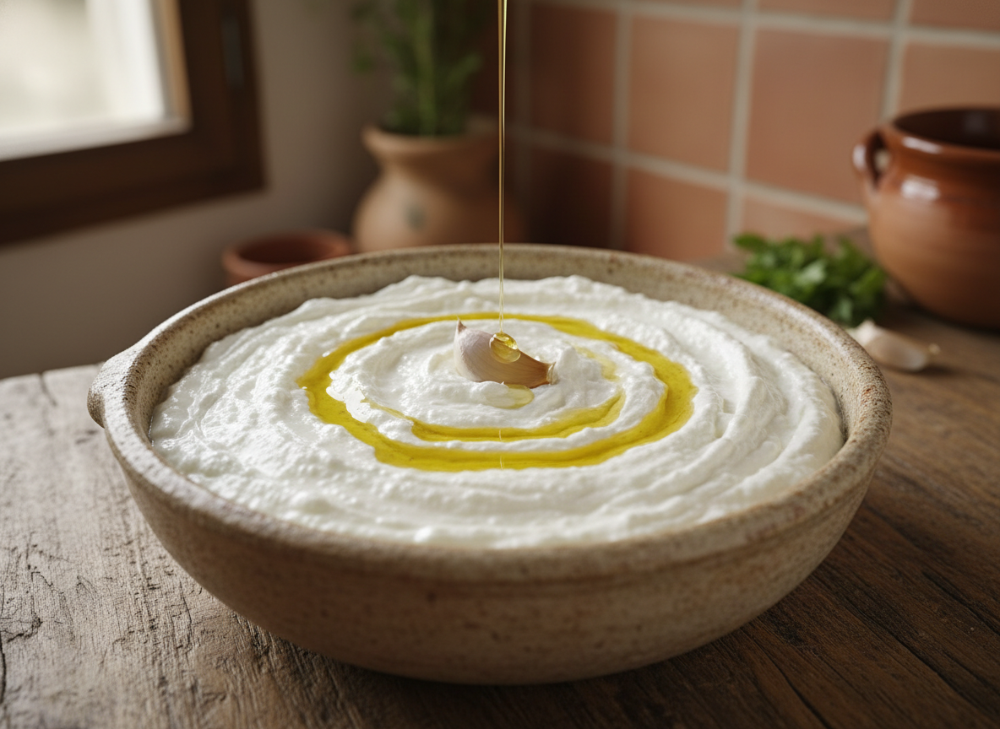

# Alioli con Clara de Huevo

Emulsión ultraligera basada en proteínas de clara sin yema ni sal. Técnica que produce un alioli de color blanco nuclear, textura aireada tipo mousse y sabor limpio donde el ajo domina el perfil organoléptico.

| Tiempo | Dificultad | Comensales |
|--------|------------|------------|
| 5 min  | Media      | 4-6        |

## Ingredientes

**Base emulsionante:**
- 1 clara de huevo (35 g aprox.) a temperatura ambiente
- 150-200 ml aceite de oliva suave (0,4º acidez máx.)
- 2-3 dientes de ajo sin germen
- 10 ml zumo de limón fresco

**Opcional:**
- Pizca de sal fina (si se desea)

## Elaboración

1. **Preparación del ajo:** Pelar los dientes, cortar longitudinalmente y extraer el germen central para evitar amargor. Picar finamente o machacar en mortero.

2. **Montaje de ingredientes:** En vaso batidor estrecho, colocar la clara (temperatura ambiente obligatoria), ajo procesado y zumo de limón. No batir aún.

3. **Adición de aceite:** Verter los 150-200 ml de aceite de golpe sobre la clara. No mezclar.

4. **Técnica de la base:** Introducir la batidora de brazo hasta el fondo del vaso. Mantener inmóvil durante 5-8 segundos hasta observar formación de base blanca y espesa en el fondo.

5. **Emulsión progresiva:** Elevar la batidora con movimiento ascendente lento y continuo. La emulsión subirá arrastrando el aceite. Movimiento total: 10-15 segundos.

6. **Control de textura:** Si queda aceite libre en superficie, reintroducir batidora con pulsos cortos hasta integración completa.

## Notas del Chef

**Fundamento técnico:**  
La clara contiene proteínas globulares (ovoalbúmina, ovotransferrina) que, al desnaturalizarse por acción mecánica y ácida, despliegan sus cadenas y atrapan gotas de aceite formando una red emulsionada. Sin lecitina de yema, la emulsión es menos estable pero más ligera. El ácido del limón acelera la desnaturalización proteica y estabiliza el pH.

**Punto crítico:**  
Temperatura de la clara (18-22°C). Clara fría impide desplegamiento proteico y provoca colapso de emulsión. Proporción máxima: 200 ml aceite por clara; exceso provoca separación por insuficiencia de agente emulsionante.

**Ajuste de consistencia:**  
- Textura firme (tipo mayonesa): 150 ml aceite por clara
- Textura fluida (tipo salsa ligera): 180-200 ml aceite por clara
- Corrección: Si queda muy líquida, añadir 10-20 ml más de aceite con batidora en marcha

**Errores comunes:**  
- Mover la batidora antes de formar la base (ruptura de emulsión)
- Clara recién sacada de nevera (fallo estructural)
- Exceso de aceite (separación de fases)
- Ajo con germen (amargor excesivo)

**Conservación:**  
Refrigerar en recipiente hermético máximo 48 horas. No congelar (desnaturalización irreversible).

**Maridaje y aplicaciones:**  
Ideal para pescados a la plancha, marisco cocido, patatas al vapor y crudités. Su ligereza lo hace apropiado para temperatura de servicio entre 12-15°C. En contexto mediterráneo, acompaña arroz a banda, fideuá y suquet de peix.
