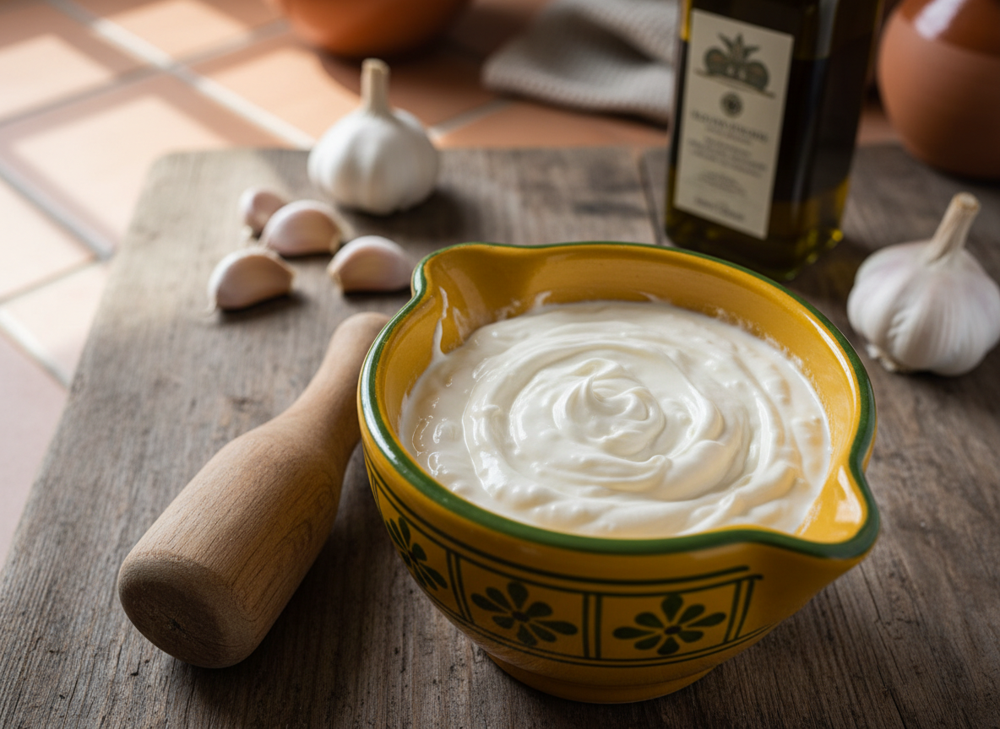

# Ali-oli Tradicional (All i Oli)

Emulsión ancestral mediterránea que fusiona únicamente ajo y aceite mediante técnica de mortero. Requiere paciencia y movimiento circular constante para lograr la emulsión perfecta sin agentes externos.

| Tiempo | Dificultad | Comensales |
|--------|------------|------------|
| 25 min | Alta | 4-6 |

## Ingredientes

### Base
- 4 dientes de ajo fresco (20 g)
- 200 ml de aceite de oliva virgen extra (sabor suave)
- 2 g de sal gruesa

### Opcional (rescate de emulsión)
- 15 ml de agua tibia
- 1 diente de ajo adicional

## Utensilios Necesarios

- **Mortero de cerámica** (preferiblemente amarillo tradicional con motivos verdes)
- **Mano de mortero** (madera o cerámica)
- **Aceitera de chorro fino** (opcional pero muy recomendable)
- **Cuchillo de cocina**
- **Tabla de cortar**

## Elaboración

1. **Preparación del ajo:** Pelar los dientes de ajo y retirar completamente el germen central (parte verde) para evitar repeticiones y amargor. Cortar en trozos pequeños para facilitar el machacado.

2. **Formación de la pasta base:** Colocar los trozos de ajo en el mortero junto con la sal gruesa. Machacar con movimientos verticales (arriba-abajo) presionando firmemente cada trozo por separado hasta obtener una pasta completamente homogénea y cremosa. Este paso es **crítico** y puede tomar 5-7 minutos.

3. **Inicio de la emulsión:** Con la pasta de ajo lista, comenzar a añadir aceite **literalmente gota a gota** (no en hilo). Cambiar ahora a movimientos circulares constantes en un solo sentido (siempre el mismo). La emulsión comenzará a formarse lentamente.

4. **Desarrollo progresivo:** Continuar añadiendo aceite muy gradualmente mientras se mantiene el movimiento circular sin interrupción. Cuando la mezcla comience a espesar y "frenar" el movimiento del mortero, se puede incrementar ligeramente el flujo de aceite (pasar de gotas a hilo muy fino).

5. **Finalización:** Una vez incorporado todo el aceite y lograda una textura espesa similar a mayonesa, verificar el punto de emulsión volteando el mortero: el ali-oli debe quedar adherido sin deslizarse.

6. **Servicio inmediato:** Servir a temperatura ambiente. No refrigerar, ya que la emulsión se desestabilizará. Este ali-oli debe consumirse dentro de las 2 horas de preparación.

## Notas del Chef

### Técnica Profesional
- La emulsión del ali-oli tradicional se logra mediante la fricción constante entre el aceite y la pasta de ajo, creando una red molecular estable sin emulsionantes adicionales.
- El movimiento **debe ser siempre circular y en el mismo sentido** - cambiar de dirección o detener el movimiento puede romper la emulsión.
- La temperatura ambiente (20-22°C) es ideal; ingredientes fríos dificultan la emulsión.

### Punto Crítico: Rescate de Emulsión Cortada
Si el ali-oli se corta (se vuelve líquido y separa):
1. **Método del ajo fresco:** Retirar la mezcla cortada. Machacar un diente de ajo nuevo con sal. Ir incorporando muy lentamente el ali-oli cortado al ajo fresco mientras se mantiene el movimiento circular.
2. **Método del agua:** Añadir 10-15 ml de agua tibia y batir enérgicamente en círculos hasta recuperar la emulsión.

### Variantes Regionales
- **Catalana:** Aceite de oliva arbequina (más suave)
- **Valenciana:** Proporción 3:1 de aceite respecto al ajo
- **Mallorca:** Añadir unas gotas de limón al final (no tradicional pero estabiliza)
- **Versión moderna:** Incorporar yema de huevo como emulsionante para mayor estabilidad (ya no es ali-oli auténtico)

### Errores Comunes
- Añadir aceite demasiado rápido al inicio (principal causa de corte)
- No machacar suficientemente el ajo antes de añadir aceite
- Usar aceite de oliva demasiado intenso (resulta amargo)
- Cambiar la dirección del movimiento circular
- No retirar el germen del ajo (repetirá y será muy fuerte)

### Maridaje y Uso
- **Clásico:** Arroces de pescado (arroz a banda, caldero), fideuá
- **Tradicional:** Patatas cocidas o fritas, verduras asadas
- **Contemporáneo:** Pescados a la plancha, carnes blancas, bocadillos

### Conservación
El ali-oli tradicional **no se conserva**. Debe consumirse en el momento por dos razones:
1. La emulsión es inestable y se descompondrá en horas
2. Al no llevar huevo ni ácido, no hay conservantes naturales

Para preparaciones con anticipación, considerar la versión moderna con huevo (más estable).