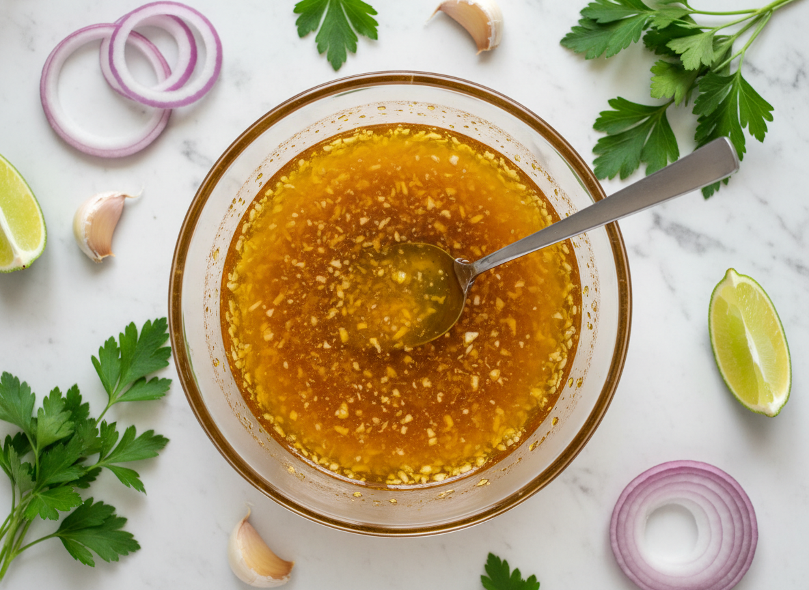

# Mojo de ajo a la veracruzana

Salsa emblemática de la cocina costera mexicana, fundamental en la tradición culinaria de Veracruz. El control térmico del aceite es crítico para lograr la caramelización sin quemar el ajo.

| Tiempo | Dificultad | Comensales |
|--------|------------|------------|
| 20 min | Media | 4-6 |

## Ingredientes

- 200 ml aceite de oliva virgen extra
- 20 dientes de ajo (aprox. 100 g)
- 4 chiles de árbol secos
- 30 ml jugo de limón fresco
- 10 ml vinagre de manzana (opcional, estilo Veracruz)
- 5 g sal de mar
- 2 g pimienta negra recién molida
- 1 g comino molido (opcional, estilo Veracruz)
- 10 g cilantro o perejil fresco picado
- 1 cebolla pequeña (opcional, para versión veracruzana)

## Elaboración

1. **Preparación del ajo:** Pelar los dientes de ajo y cortarlos en láminas de 2 mm de grosor. Mantener uniformidad para cocción homogénea.

2. **Control térmico:** Calentar el aceite en sartén de fondo grueso a 140°C. Verificar temperatura introduciendo una lámina de ajo; debe burbujear suavemente sin dorarse de inmediato.

3. **Confitado del ajo:** Incorporar las láminas de ajo. Cocinar 8-10 minutos, removiendo constantemente hasta alcanzar color dorado claro. El ajo debe quedar suave y fragante, nunca crujiente.

4. **Incorporación del chile:** Añadir los chiles de árbol enteros. Freír 30 segundos hasta que liberen aroma. Retirar del fuego inmediatamente para evitar amargor.

5. **Emulsión final:** Fuera del fuego, agregar el jugo de limón en hilo fino mientras se remueve vigorosamente. Incorporar sal y pimienta. La emulsión debe quedar brillante y ligera.

6. **Acabado:** Añadir el perejil picado justo antes de servir. Presentar caliente directamente desde cazuela de barro.

## Notas del Chef

**Técnica:** La clave reside en el control de temperatura. El ajo debe confitarse, no freírse. Si se quema, adquiere sabor amargo que arruina la preparación. Use termómetro digital para precisión.

**Punto Crítico:** La adición del limón crea una microemulsión que estabiliza la salsa. Añadirlo gradualmente y fuera del fuego previene salpicaduras peligrosas y separación de la grasa.

**Usos:** Ideal para pescados a la plancha (robalo, huachinango), camarones salteados o langosta. También como base para marinados o para untar en pan tostado.

**Maridaje:** Vino blanco mexicano Chenin Blanc de Valle de Guadalupe, o Albariño español. La acidez del vino complementa la untuosidad del aceite y potencia el cítrico del limón.

**Conservación:** Refrigerar en recipiente hermético hasta 5 días. Dejar atemperar 15 minutos antes de servir para recuperar textura fluida.

**Secretos Veracruzanos:**
- **Doble ácido:** Combinar 20 ml limón + 10 ml vinagre en lugar de solo limón. Esto aporta complejidad y es característico del estilo costero.
- **Comino:** Añadir 1 g de comino molido al aceite durante el confitado del ajo. Es el sello distintivo veracruzano.
- **Pasta de mortero:** Para máxima intensidad, machacar en molcajete 5 dientes de ajo con 1 chile + 1 tomate pequeño. Añadir esta pasta al aceite antes de freír el resto del ajo fileteado.
- **Cebolla en juliana:** Freír 1 cebolla en juliana junto con el ajo. Sofríe hasta color dorado antes de añadir los chiles.
- **Cilantro vs perejil:** En Veracruz se prefiere cilantro fresco. Usar perejil solo si no se dispone de cilantro.
- **Fuego medio-bajo:** Cocinar a fuego medio-bajo (120-130°C) evita que la salsa quede demasiado líquida por exceso de calor.
- **Presentación costera:** Servir con mayonesa al lado como acompañamiento tradicional veracruzano para pescados y mariscos.
