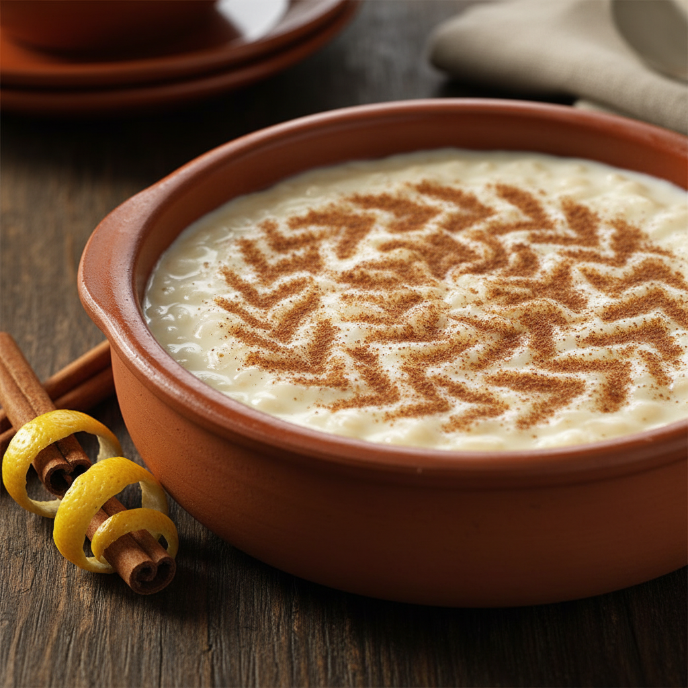

# Arroz con Leche Estilo Casa Gerardo

El postre legendario del restaurante con estrella Michelin de Prendes (Asturias), con más de 140 años de tradición. Su secreto: la técnica del "reventado" previo del arroz que crea una textura de crema sedosa, casi sin percibir granos individuales. Esta versión está calculada exactamente para usar 3 litros completos de leche de caja, manteniendo la proporción sagrada de 13:1 (leche:arroz).

| Tiempo | Dificultad | Comensales |
|--------|------------|------------|
| 2h 40min (25 min prep + 2h 15min cocción) | Alta | 10-12 pax |

## Ingredientes

### Base láctea
* 3 litros de leche entera de caja (UHT)
* 600 ml de nata líquida para montar (35% M.G.)
* 115g de mantequilla sin sal

### Arroz y líquido de reventado
* 230g de arroz redondo tipo Bomba
* 460 ml de agua

### Aromáticos
* 2 ramas de canela de Ceilán
* 1 vaina de vainilla entera
* 2-3g de sal fina (½ cucharadita)

### Dulzor
* 460g de azúcar blanquilla (reducible a 300-350g para gusto moderno)
* Azúcar extra para caramelizar

## Elaboración

1. **Preparar el "moño" aromático:** Atar juntas las ramas de canela y la vaina de vainilla (abierta longitudinalmente con cuchillo). Este atado tradicional facilita retirarlo después sin dejar restos en el arroz.

2. **Reventar el arroz (TÉCNICA FUNDAMENTAL):** En un cazo mediano, cocer los 230g de arroz con los 460ml de agua y el moño aromático durante 20-25 minutos a fuego medio, removiendo ocasionalmente. El objetivo es que el arroz absorba toda el agua y **se rompa formando una pasta espesa**. Esta rotura del grano libera el almidón sin interferencia del calcio de la leche, creando la textura cremosa característica. **Al finalizar, retirar y descartar el moño aromático.** El arroz ya ha absorbido todo el aroma necesario.

3. **Hervir la leche una sola vez:** En una olla muy grande (mínimo 6-8 litros), mezclar los 3 litros de leche con los 600ml de nata. **La leche NO lleva aromáticos, se cuece sola.** Llevar a ebullición removiendo ocasionalmente. Como es leche UHT (ya ultrapasteurizada), **solo necesita hervir UNA vez**, no dos como la leche fresca. Reducir a fuego medio tras el hervor.

4. **Cocción principal - REMOVIDO CONSTANTE:** Incorporar la pasta de arroz reventado (ya sin el moño aromático) a la leche hirviendo. Con pala de madera grande, remover hasta que rompa a hervir. **A partir de este momento, NO dejar de remover bajo ningún concepto** durante 60-75 minutos. El arroz se pegaría irremediablemente al fondo. La mezcla irá espesando gradualmente. Usar fuego medio-bajo y, si es gas, colocar difusor de calor.

5. **Incorporar la mantequilla:** Cuando la mezcla esté espesa (al levantar la pala debe quedar marca visible y caer lentamente), añadir los 115g de mantequilla en dados pequeños mientras se continúa removiendo. La mantequilla aporta untuosidad característica.

6. **Sal y azúcar fuera del fuego:** Retirar del fuego y dejar bajar temperatura 2-3 minutos. Añadir la sal y espolvorear los 460g de azúcar "en forma de nieve" sin dejar de remover. La crema se aligerará momentáneamente; recuperará densidad al enfriar.

7. **Emplatar y enfriar:** Distribuir en 10-12 cuencos individuales de cerámica o 2-3 fuentes medianas. Dejar enfriar completamente a temperatura ambiente, luego refrigerar mínimo 3-4 horas (idealmente toda la noche). **Crucial:** el arroz debe estar completamente frío antes de caramelizar.

8. **El requemado final:** Justo antes de servir, espolvorear azúcar generosamente sobre la superficie. Caramelizar con **plancha eléctrica o pala de hierro caliente** (método tradicional Casa Gerardo, superior al soplete). El contraste entre la crema fría y el caramelo crujiente caliente es la firma del postre.

## Notas del Chef

### Trucos Profesionales
* **La técnica del reventado es innegociable:** Al cocinar el arroz solo en agua primero, el grano libera todo su almidón sin que el calcio de la leche dificulte la rotura. Resultado: textura de crema homogénea, casi sin granos individuales.
* **Por qué 600ml de nata:** Al usar leche de caja en lugar de leche fresca de ordeño (mucho más grasa), añadimos nata (20% del volumen total de líquido) para compensar y conseguir la cremosidad auténtica. Recomendación directa de Marcos Morán.
* **Proporción sagrada 13:1:** Casa Gerardo usa 13 litros de leche por cada kilo de arroz. Esta receta mantiene esa proporción exacta (3L de leche + 0.6L de nata = 3.6L ÷ 0.23kg arroz ≈ 15.6:1, ajustada por la nata).
* **Gestión del removido:** Con esta cantidad, considera turnarte con otra persona. 75 minutos de removido constante es agotador. Los Morán insisten: "mucha paciencia y remover sin descanso hasta que esté en su punto".
* **Olla adecuada:** Imprescindible olla de 6-8 litros con fondo grueso (triple fondo ideal). Con 3.6L de líquido + arroz, la mezcla al hervir sube mucho y necesita distribución uniforme de calor.

### Errores Comunes
* **Saltar el reventado previo:** Sin esta técnica, obtendrás arroz con leche normal, nunca la textura cremosa característica asturiana.
* **Dejar de remover:** Una vez hierva la leche con el arroz, abandonar la pala = arroz pegado y quemado. El removido es continuo e innegociable.
* **Caramelizar en caliente:** Si el arroz no está completamente frío, el azúcar se disolverá en lugar de formar costra crujiente.
* **Usar olla pequeña:** Con menos de 6L, la mezcla se desbordará al hervir. No escatimes en tamaño.
* **Añadir azúcar con el fuego:** El azúcar debe incorporarse fuera del fuego para evitar cristalización irregular.

### Variaciones
* **Versión menos dulce contemporánea:** Reducir el azúcar a 300-350g. Probar antes de añadirlo todo.
* **Sin vainilla:** La receta más tradicional solo usa canela. La vainilla es aportación moderna de Casa Gerardo.

### Maridaje
* **Tradicional asturiano:** Sidra natural o vino dulce de manzana.
* **Contemporáneo:** Oloroso viejo en pequeñas cantidades para contraste fascinante, o moscatel ligero.

### Conservación y Servicio
* Se conserva perfectamente 4-5 días en nevera en recipientes herméticos.
* **Mejora al día siguiente:** Los sabores se integran completamente, es el momento óptimo de consumo.
* **Siempre servir frío:** Nunca caliente. La textura y el sabor alcanzan su plenitud en frío.
* Esta cantidad (3L de leche) produce 10-12 raciones generosas, ideal para celebraciones familiares o tener disponible varios días.

### Equipamiento Necesario
* Olla de fondo grueso de 6-8 litros
* Cazo mediano para reventar arroz
* Pala de madera grande resistente
* Difusor de calor (si cocinas en gas)
* Plancha eléctrica o pala de hierro para caramelizar (preferible a soplete)
* 10-12 cuencos individuales de cerámica o vidrio refractario
