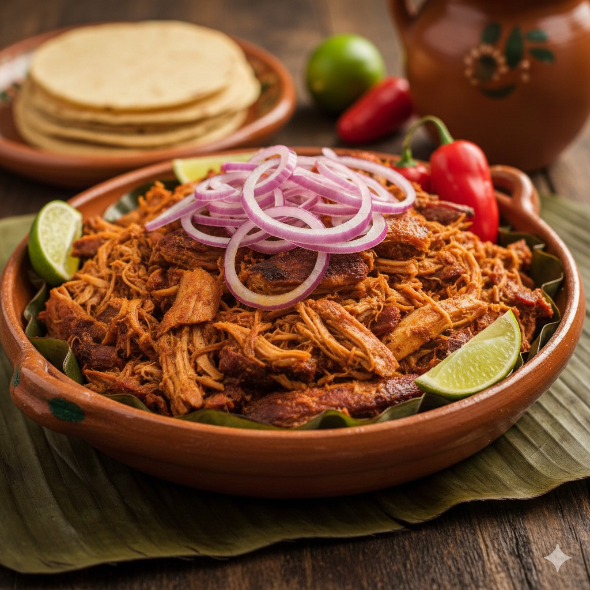

# Cochinita Pibil

## Contexto Culinario
Plato emblemático de Yucatán. La técnica del *pib* (horno de tierra maya) se adapta a cocción lenta en horno doméstico. El recado rojo y la naranja agria definen su perfil ácido-especiado característico.

## Ficha Técnica

| Parámetro | Valor |
|-----------|-------|
| **Tiempo Total** | 5-6 horas (+ 12h marinado) |
| **Dificultad** | Media |
| **Comensales** | 12 personas |

---

## Ingredientes

### Proteína Base
- 3 kg de paleta de cerdo (con grasa infiltrada)
- 4 hojas de plátano frescas (120 x 80 cm aprox.)

### Recado Rojo (Achiote)
- 200 g de pasta de achiote
- 400 ml de jugo de naranja agria (o 280 ml naranja dulce + 120 ml limón)
- 12 dientes de ajo
- 2 cucharaditas de comino molido
- 2 cucharaditas de pimienta negra molida
- 1 cucharadita de orégano mexicano
- 16 clavos de olor
- 2 cucharaditas de sal de mar
- 120 ml de vinagre blanco

### Cebolla Encurtida (Xnipec)
- 4 cebollas moradas
- 300 ml de jugo de naranja agria
- 2 habaneros (opcional, para pungencia)
- Sal al gusto

### Guarnición
- Tortillas de maíz nixtamalizado
- Cilantro fresco

---

## Elaboración

### Día 1: Marinado (Preparación 30 minutos)

1. **Preparación del recado:** En procesador, moler pasta de achiote, ajo, especias y sal con el jugo de naranja agria hasta obtener pasta homogénea. Añadir vinagre, ajustar consistencia (debe cubrir sin escurrir).

2. **Preparación de la carne:** Cortar la paleta en cubos de 8-10 cm. Mantener grasa visible (aportará jugosidad).

3. **Marinado:** En recipiente no reactivo (vidrio/acero), cubrir completamente la carne con el recado. Refrigerar mínimo 12 horas, máximo 24 horas. Voltear a mitad del tiempo.

### Día 2: Cocción (4-5 horas)

4. **Preparación de hojas:** Pasar las hojas de plátano sobre fuego directo 10 segundos por lado (flexibiliza y libera aroma). Limpiar con paño húmedo.

5. **Ensamblaje del pibil:**
   - Forrar bandeja honda con primera hoja (lado brillante hacia arriba).
   - Depositar la carne con todo el marinado en el centro.
   - Añadir 200 ml de agua al fondo de la bandeja (genera vapor).
   - Cubrir con segunda hoja. Sellar bordes plegando.
   - Cubrir toda la bandeja con papel aluminio (doble capa, hermético).

6. **Cocción lenta:** 
   - Precalentar horno a 150°C (calor arriba/abajo).
   - Hornear 5 horas sin abrir.
   - Aumentar a 170°C, cocinar 45-60 minutos adicionales (carne debe deshilacharse con tenedor).

7. **Reposo:** Dejar reposar 15 minutos dentro del horno apagado antes de abrir.

### Cebolla Encurtida (Preparar 2 horas antes de servir)

8. **Corte y desflemado:** Cortar cebolla en juliana fina (2 mm). Escaldar 30 segundos en agua hirviendo, escurrir inmediatamente en agua helada.

9. **Encurtido:** Mezclar con jugo de naranja agria, habanero en rodajas (sin semillas) y sal. Reposar mínimo 2 horas a temperatura ambiente.

---

## Notas del Chef

### Técnica
El achiote contiene bixina, carotenoide liposoluble que requiere grasa para desarrollar color y sabor. La naranja agria (pH 2.5-3.0) desnaturaliza proteínas y ablanda tejido conectivo sin "cocinar" la carne como lo haría el limón puro. El sellado con hojas de plátano crea un ambiente de vapor saturado (100% humedad) que previene la deshidratación.

### Punto Crítico
**Abrir el paquete antes de las 4 horas resulta en carne fibrosa y seca**. La gelatinización del colágeno requiere tiempo constante a temperatura moderada. Hornos de convección aceleran el proceso pero resecan; usar solo calor estático. **No usar papel encerado o pergamino**: las hojas de plátano aportan compuestos volátiles (vainillina, eugenol) esenciales para el perfil aromático.

### Maridaje
**Cerveza clara mexicana** (Corona, Pacífico, Victoria) servida a 4-6°C. La carbonatación limpia la grasa del paladar y el amargor del lúpulo equilibra la acidez cítrica. Alternativa: **Agua de jamaica** natural (sin azúcar añadido) para contraste floral.
