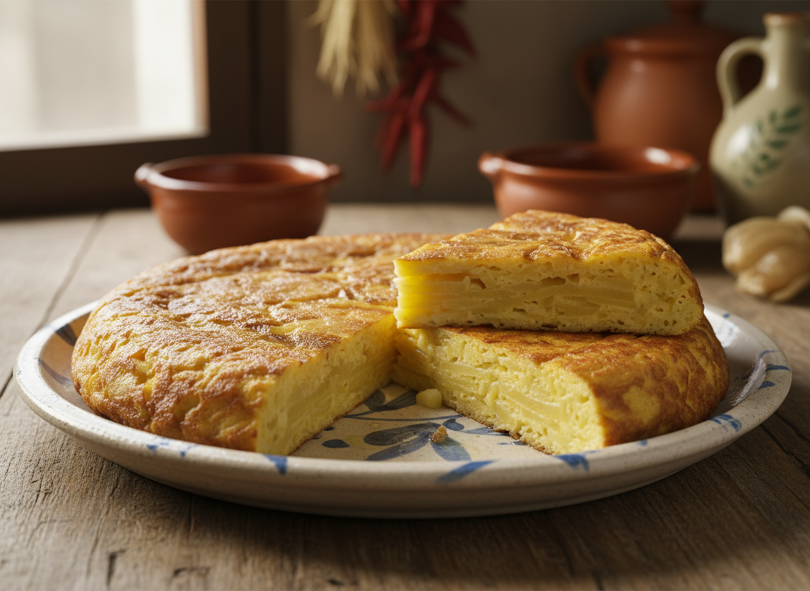

# Tortilla de Patatas con Cebolla

Emblema de la gastronomía popular española elevado a técnica. La clave reside en el confitado lento de las patatas y el control exacto de la coagulación proteica del huevo.

| Tiempo | Dificultad | Comensales |
|--------|-----------|-----------|
| 45 min | Media | 4 |

## Ingredientes

* 800 g de patatas (variedad Kennebec o Monalisa)
* 300 g de cebolla (preferiblemente dulce)
* 6 huevos camperos XL
* 500 ml de aceite de oliva virgen extra (para confitar)
* 6 g de sal fina
* Pimienta negra recién molida (opcional)

## Elaboración

1. Pelar las patatas y cortarlas en láminas de 3-4 mm de grosor. Cortar la cebolla en juliana fina (2 mm).

2. Calentar el aceite en una sartén amplia (28-30 cm) hasta alcanzar 150°C. Incorporar la cebolla con 2 g de sal y confitar durante 15-20 minutos removiendo ocasionalmente hasta que esté completamente pochada, traslúcida y haya liberado toda su agua. Retirar y reservar.

3. Elevar la temperatura del aceite a 160-170°C. Incorporar las patatas con los 2 g de sal restantes y confitar durante 20-25 minutos, removiendo ocasionalmente. Las patatas deben estar tiernas, cremosas pero no doradas, sin absorber el agua de la cebolla.

4. Escurrir las patatas y reunirlas con la cebolla en un colador durante 2-3 minutos, reservando el aceite para otros usos. Es crítico eliminar el exceso de grasa para evitar una tortilla aceitosa.

5. Batir los huevos en un bol amplio con 2 g de sal restante. Incorporar las patatas y cebolla templadas, mezclar suavemente con espátula para no romper las láminas. Dejar reposar 2-3 minutos para que el conjunto se integre.

6. Calentar una sartén antiadherente de 24 cm con 2 cucharadas del aceite de confitar a fuego medio-alto. Cuando esté caliente, verter la mezcla y bajar inmediatamente a fuego medio.

7. Cocinar 3-4 minutos removiendo ligeramente los bordes con espátula para formar pliegues. Cuando la base esté cuajada pero el centro aún líquido, voltear con ayuda de un plato.

8. Deslizar de nuevo a la sartén y cocinar otros 2-3 minutos para el punto jugoso (interior cremoso a 65-70°C). Para punto más cuajado, prolongar 1-2 minutos adicionales.

9. Retirar a un plato y dejar reposar 2 minutos antes de servir. La tortilla debe presentar estructura firme en el exterior y textura sedosa en el interior.

## Notas del Chef

### Técnica
Freír por separado es fundamental: la cebolla libera agua (80-90% de su composición) que diluye el aceite y baja su temperatura, provocando que las patatas absorban líquido en lugar de confitarse correctamente. El confitado aislado a 160-170°C permite la gelatinización del almidón sin caramelización, textura cremosa con estructura. La coagulación del huevo ocurre entre 62-70°C: a 65°C conseguimos el punto jugoso perfecto donde las proteínas forman una red que retiene humedad sin expulsar suero.

### Punto Crítico
**Error mortal:** Añadir las patatas recién escurridas y muy calientes al huevo provoca coagulación prematura desigual. Temperatura ideal de las patatas al mezclar: 50-60°C. **Segundo error:** Fuego excesivo al cuajar provoca exterior quemado con interior líquido. El control térmico gradual es no negociable.

### Maridaje
Vino blanco joven con cuerpo y acidez moderada: Verdejo de Rueda o Albariño de Rías Baixas (servir a 8-10°C). Para versión más robusta con cebolla caramelizada, considerar un tinto joven ligero tipo Mencía del Bierzo ligeramente refrigerado (12-14°C).
