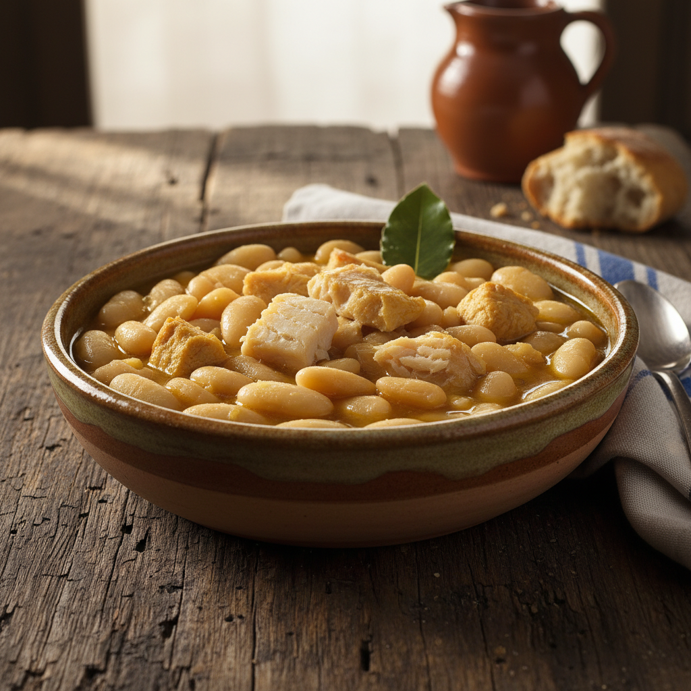

# Fabas con Bacalao (Adaptada para Colesterol y Ácido Úrico)

Un clásico asturiano reinterpretado para cuidar la salud sin renunciar al sabor profundo de las fabes.

**Tiempo:** 2h 30min (más remojo) | **Comensales:** 4 pax

## Ingredientes

* 500g de fabes de la Granja o fabes asturianas
* 200g de pechuga de pollo campero
* 150g de lacón magro (sin grasa visible)
* 1 cebolla grande
* 3 dientes de ajo
* 1 hoja de laurel
* 1 cucharadita de pimentón dulce ahumado
* Aceite de oliva virgen extra (30ml)
* Sal (moderada)
* Azafrán en hebra (opcional, para color y aroma)

## Elaboración

1. Remojar las fabes en agua fría durante 12 horas, cambiando el agua a mitad del proceso (esto reduce purinas).
2. Escurrir las fabes y ponerlas en una olla amplia con agua fría que las cubra generosamente. Añadir el laurel.
3. Llevar a ebullición y "asustar" las fabes 2-3 veces añadiendo un vaso de agua fría cada vez que rompa el hervor (técnica tradicional para que queden enteras).
4. Mientras, dorar la pechuga de pollo cortada en dados medianos en una sartén con un hilo de aceite. Reservar.
5. En el mismo aceite, pochar la cebolla picada muy fina y los ajos laminados a fuego suave hasta que estén transparentes.
6. Añadir el sofrito a las fabes junto con el lacón cortado en dados (previamente desalado si es necesario).
7. Cocinar a fuego lento durante 1h 30min - 2h, removiendo con cuidado ocasionalmente y sin romper las fabes.
8. Incorporar el pollo dorado en los últimos 20 minutos de cocción.
9. Apagar el fuego, añadir el pimentón removiendo rápidamente para que no se queme, y dejar reposar 10 minutos antes de servir.

## Notas del Chef

* **Truco:** El doble remojo y desechar el agua reduce significativamente las purinas de las legumbres sin afectar su textura.
* **Adaptación saludable:** Esta versión elimina el chorizo, la morcilla y el tocino tradicionales, sustituyéndolos por proteínas magras que aportan sabor sin comprometer la salud cardiovascular.
* **Error común:** No añadir sal hasta el final de la cocción; la sal endurece las fabes si se añade al principio.
* **Importante:** Usa fabes de cosecha reciente (máximo 1 año). Las fabes viejas pueden necesitar bicarbonato de sodio o cocción en olla exprés para ablandar.
* **Maridaje:** Sidra natural asturiana servida a "espicha" o un vino blanco seco con cuerpo como un Albariño.
* **Variación:** Para intensificar el sabor sin añadir grasa, añade una cucharada de concentrado de tomate natural al sofrito o un hueso de jamón magro (retirar antes de servir).
