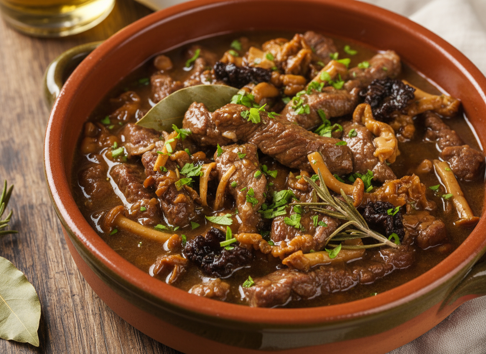

# Fricandó

Guiso emblemático catalán que combina ternera en filetes finos con setas silvestres en salsa espesa. La clave está en el sofrito paciente y la gelificación del colágeno de la carne.

| Tiempo | Dificultad | Comensales |
|--------|------------|------------|
| 2h 30min | Media | 4 |

## Ingredientes

### Carne
- 800g de redondo de ternera (en filetes de 0,5cm)
- 50g de harina de trigo
- Sal y pimienta negra recién molida
- 60ml de aceite de oliva virgen extra

### Sofrito Base
- 2 cebollas medianas (300g)
- 2 tomates maduros (400g)
- 4 dientes de ajo
- 1 hoja de laurel

### Componente Fúngico
- 400g de setas variadas (moixernons, shiitake, rebozuelos)
- 2 cucharadas de aceite de oliva

### Líquidos
- 200ml de vino blanco seco
- 400ml de caldo de carne o ternera
- 1 ramita de tomillo fresco

### Picada Final
- 30g de almendras tostadas
- 1 diente de ajo
- 10g de perejil fresco
- 20ml de aceite de oliva

## Elaboración

1. **Preparación de la Carne:** Salpimentar los filetes y enharinar ligeramente sacudiendo el exceso. En cazuela de hierro con aceite caliente, dorar por ambos lados (2min/lado) hasta conseguir costra. Reservar.

2. **Sofrito Tradicional:** En el mismo aceite, añadir cebolla picada fina y pochar a fuego medio-bajo durante 20min hasta transparencia total. Incorporar ajo laminado y cocinar 2min más.

3. **Integración del Tomate:** Rallar los tomates descartando la piel. Añadir al sofrito junto con el laurel. Cocinar 25-30min removiendo ocasionalmente hasta reducción completa del agua y aparición de aceite en superficie.

4. **Deglasar y Montar:** Subir fuego, añadir vino blanco y raspar los fondos caramelizados. Reducir alcohol 3min. Incorporar caldo, tomillo y llevar a ebullición.

5. **Cocción Lenta:** Introducir filetes de ternera en la salsa. Tapar y cocinar a fuego bajo 1h 15min, volteando a mitad de cocción. La carne debe deshacerse con tenedor.

6. **Tratamiento de Setas:** Saltear las setas limpias en sartén con aceite muy caliente, sin moverlas 3min hasta dorado. Condimentar y añadir a la cazuela en los últimos 15min de cocción.

7. **Picada Final:** Majar en mortero almendras, ajo y perejil con el aceite hasta pasta homogénea. Integrar a la cazuela, rectificar sal y cocinar 5min adicionales para ligar.

8. **Reposo:** Dejar reposar 10min fuera del fuego antes de servir. La salsa debe cubrir una cuchara.

## Notas del Chef

**Técnica:** El enharinado ligero crea textura en la salsa final mediante el almidón gelatinizado. La cocción lenta hidroliza el colágeno en gelatina, aportando untuosidad.

**Punto Crítico:** El sofrito requiere paciencia. La cebolla debe alcanzar translucidez completa sin color. El tomate debe reducirse hasta eliminar toda acidez cruda y concentrar sabor.

**Maridaje:** Priorat joven (Garnacha/Cariñena) o Penedès blanco envejecido en barrica. La estructura tánica equilibra la riqueza del guiso mientras las notas terrosas complementan las setas.
