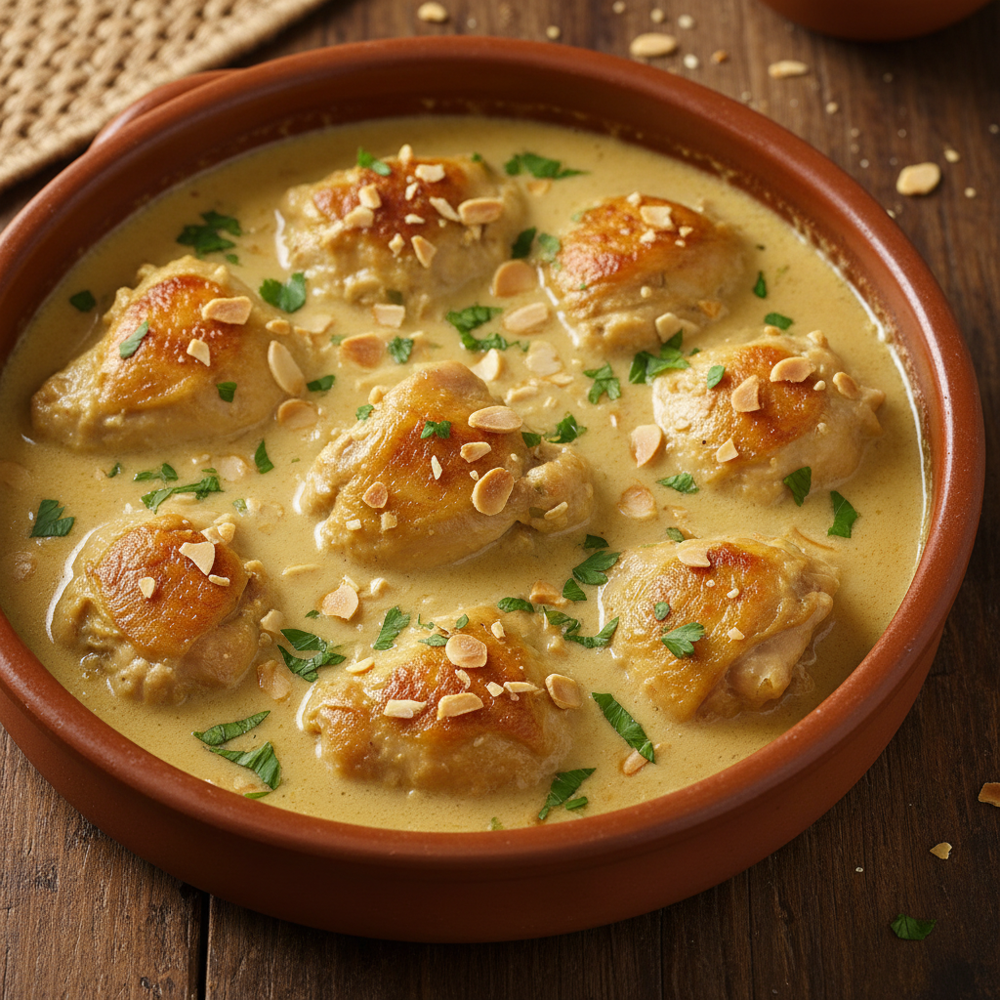

# Pollo en Pepitoria

Receta clásica castellana de la cocina de las abuelas. El secreto está en el majado de almendras y la yema final que espesa sin cuajar.

## Ficha Técnica

| Tiempo Total | Dificultad | Comensales |
|--------------|------------|------------|
| 90 min | Media | 4-6 |

## Ingredientes

### Para el Pollo
- 1 pollo de corral troceado (1,5 kg)
- 100 ml aceite de oliva virgen extra
- Sal y pimienta blanca recién molida
- 2 cucharadas harina (para rebozar)

### Para el Sofrito Base
- 2 cebollas medianas (300 g)
- 4 dientes de ajo
- 150 ml vino blanco seco (Rueda o Verdejo)
- 500 ml caldo de ave casero
- 1 hoja de laurel
- 1 rama de tomillo fresco

### Para la Pepitoria (Majado)
- 80 g almendras crudas peladas
- 20 g piñones
- 1 rebanada de pan del día anterior (30 g)
- 3 hebras de azafrán en rama
- 1/2 cucharadita de pimentón dulce
- 50 ml agua tibia

### Para el Acabado
- 3 yemas de huevo
- 2 cucharadas de perejil fresco picado
- Zumo de 1/2 limón

## Elaboración

### 1. Preparación del Pollo (Truco de la Abuela #1)
Salpimentar los trozos de pollo y pasarlos ligeramente por harina, sacudiendo el exceso. **Truco:** La abuela enharinaba muy poco, solo para sellar sin empanizar - así el pollo suelta jugo pero no queda pesado.

### 2. Sellado del Pollo
En una cazuela de barro o hierro, calentar el aceite a fuego medio-alto. Dorar los trozos de pollo por todas las caras hasta conseguir un color dorado uniforme (8-10 minutos). Reservar.

### 3. Sofrito (Truco de la Abuela #2)
En el mismo aceite, rehogar la cebolla picada muy fina a fuego bajo durante 15 minutos hasta que esté transparente y dulce. **Truco:** La abuela jamás dejaba que se dorara - "la cebolla en la pepitoria es rubia, no morena".

Añadir los ajos laminados y cocinar 2 minutos más.

### 4. Tostado del Majado (Truco de la Abuela #3)
Mientras tanto, en una sartén sin aceite, tostar las almendras y piñones hasta que estén dorados y aromáticos (4-5 minutos, vigilando constantemente). **Truco:** Tostarlas en seco intensifica el sabor y facilita el majado. La abuela decía "si no huelen a tostado, no sirven".

En la misma sartén, tostar la rebanada de pan hasta que esté crujiente.

### 5. Majado de la Pepitoria (Truco de la Abuela #4)
En un mortero, majar las almendras, piñones y el pan tostado hasta obtener una pasta fina. Añadir el azafrán (previamente tostado 10 segundos), el pimentón dulce y diluir con el agua tibia. **Truco:** El mortero es fundamental - la textura del majado a mano es irreproducible en procesador. La abuela insistía: "en la pepitoria, el brazo no se ahorra".

### 6. Cocción del Pollo
Subir el fuego del sofrito, añadir el vino blanco y dejar reducir 3 minutos. Incorporar el pollo, el caldo, el laurel y el tomillo. Llevar a ebullición.

Bajar a fuego medio-bajo, tapar parcialmente y cocinar 30 minutos.

### 7. Incorporación del Majado
Añadir el majado de almendras a la cazuela, removiendo bien para integrar. Cocinar 10 minutos más a fuego suave. Rectificar sal.

### 8. Acabado Final (Truco de la Abuela #5 - El MÁS IMPORTANTE)
Retirar la cazuela del fuego. En un bol pequeño, batir las yemas con el zumo de limón y 3 cucharadas del caldo caliente de la cazuela (templar las yemas).

Incorporar esta mezcla a la cazuela removiendo constantemente con movimiento circular y SIN VOLVER A CALENTAR. **Truco de Oro:** La abuela decía "la yema liga fuera del fuego - si vuelves a calentar, tendrás huevo revuelto con pollo". La yema debe espesar por emulsión, no por cocción.

Espolvorear con perejil picado.

## Notas del Chef

**Técnica Clave:** La pepitoria es una técnica medieval de ligar salsas con almendras y yema. El término viene del latín "pipere" (pimienta), aunque hoy no lleva. La clave está en el equilibrio del majado tostado y la yema cruda que aporta sedosidad.

**Punto Crítico:** Las yemas finales. Temperatura >65°C = cuajado irreversible. La cazuela debe estar fuera del fuego y las yemas templadas antes de incorporar. Este paso no admite prisa.

**Errores Comunes:**
- Sobre-tostar las almendras (amargor)
- Añadir las yemas con la cazuela al fuego (textura granulosa)
- Sustituir el majado de mortero por picadora (textura incorrecta)

**Variante Tradicional:** Algunas abuelas añadían 50 g de almendras picadas gruesas al final (además del majado) para dar textura de "pepitas" - de ahí el nombre.

**Maridaje:** Vino blanco con crianza y cuerpo (Rioja Blanco Fermentado en Barrica, Godello de Valdeorras) o un tinto joven de Ribera del Duero servido ligeramente fresco (14-15°C).

**Conservación:** Mejora al día siguiente. La salsa se asienta y los sabores se integran. Calentar a fuego muy suave y añadir un poco de caldo si espesó demasiado. NO recalentar en microondas (las yemas se cortan).
