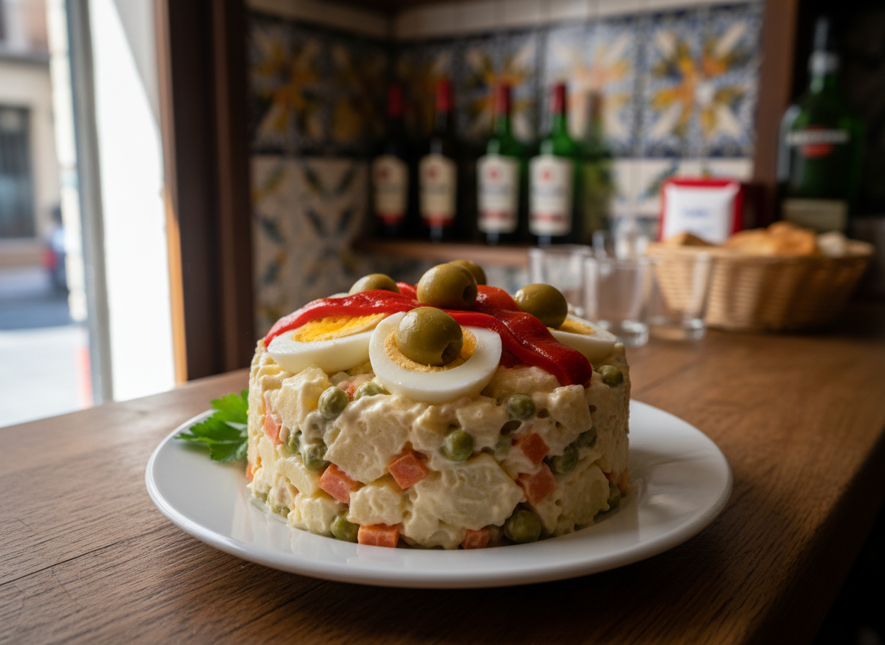

# Ensaladilla Rusa Tradicional

La receta clásica española. Una ensaladilla cremosa con la tríada sagrada: patata, zanahoria y guisantes. El equilibrio perfecto entre textura firme y cremosidad de mayonesa.

**Tiempo:** 45 min (+ enfriado) | **Comensales:** 6-8 pax

## Ingredientes

### Base
* 1kg de patatas harinosas (tipo Monalisa o Kennebec)
* 400g de zanahorias
* 300g de guisantes congelados (o 600g frescos desgranados)
* 5 huevos grandes (talla L)

### Proteína y Sabor
* 200g de atún en aceite de oliva de calidad (escurrido)
* 8-10 aceitunas verdes sin hueso rellenas de anchoa
* 2 cucharadas de alcaparras pequeñas (opcional)
* 4 pepinillos en vinagre medianos

### Mayonesa y Aliño
* 400-500ml de mayonesa casera o de calidad suprema
* 2 cucharadas de vinagre de las aceitunas o pepinillos
* Sal y pimienta blanca molida
* 1 pizca de azúcar (equilibra la acidez)

### Decoración
* 2 huevos cocidos adicionales
* Aceitunas verdes
* Langostinos cocidos (opcional)
* Pimientos del piquillo en tiras
* Perejil fresco

## Elaboración

### Paso 1: Cocción de las Verduras (Crítico)

1. **Patatas y zanahorias:** Pelar ambas y cortar en dados regulares de 1-1.5cm. Cocinar JUNTAS en agua fría con sal durante 15-18 minutos. CRUCIAL: Deben quedar firmes, ligeramente al dente. Un palillo debe entrar con una leve resistencia. La zanahoria debe mantener su forma sin deshacerse. Escurrir inmediatamente y extender sobre una bandeja para que se sequen y enfríen sin romperse.

2. **Guisantes:** Blanquear los guisantes congelados 2-3 minutos en agua hirviendo. Escurrir y enfriar en agua helada para mantener el color verde brillante. Si usas guisantes frescos, cocinar 5-7 minutos.

3. **Huevos:** Cocinar durante exactamente 10 minutos desde que rompe el hervor. Inmediatamente a agua helada durante 5 minutos. Pelar, picar en dados pequeños y reservar separando las yemas de las claras.

### Paso 2: Montaje (El Momento de la Verdad)

4. **Enfriamiento total:** FUNDAMENTAL. Todas las verduras deben estar completamente frías antes de mezclar con la mayonesa. Si añades mayonesa a verduras calientes, se corta y queda líquida.

5. **Mezclar ingredientes secos:** En un bol amplio, mezclar con delicadeza las patatas, zanahorias, guisantes, las claras de huevo picadas, el atún desmigado (nunca desmenuzarlo demasiado fino), las aceitunas cortadas en rodajas y los pepinillos picados.

6. **Primera capa de mayonesa:** Añadir 2/3 de la mayonesa. Mezclar con movimientos envolventes, de abajo hacia arriba, usando una espátula de silicona. NUNCA remover con fuerza o la patata se romperá y quedará un puré.

7. **Ajustar textura:** La ensaladilla debe quedar cremosa pero no ahogada. Añade el resto de mayonesa poco a poco hasta conseguir una textura untuosa donde los ingredientes queden ligeramente ligados pero distinguibles.

8. **Aliño final:** Añadir el vinagre de los pepinillos, las yemas de huevo desmigadas con un tenedor (esto aporta cremosidad y sabor), sal, pimienta blanca y la pizca de azúcar. Mezclar suavemente.

9. **Reposo en frío:** Refrigerar mínimo 2 horas, idealmente 4-6 horas o toda la noche. Esto permite que los sabores se integren y la ensaladilla alcance su punto óptimo.

### Paso 3: Presentación

10. **Emplatar:** Servir en fuente plana o en molde de aro para un acabado profesional. Cubrir la superficie con una fina capa de mayonesa alisada con espátula.

11. **Decorar:** Decorar con medios huevos cocidos, aceitunas, tiras de pimiento del piquillo, langostinos cocidos y perejil fresco. La presentación debe ser generosa y atractiva.

## Notas del Chef

* **Secreto Profesional:** La diferencia entre una ensaladilla casera y una de restaurante está en tres puntos: (1) cocción perfecta de patatas y zanahorias (firmes, nunca pasadas), (2) mayonesa de calidad en cantidad generosa pero equilibrada, (3) enfriamiento total antes de mezclar.

* **La Tríada Clásica:** La versión tradicional española siempre incluye patata, zanahoria y guisantes. La zanahoria aporta dulzor natural y un contraste cromático esencial. El ratio ideal es 50% patata, 20% zanahoria, 15% guisantes, 15% otros ingredientes.

* **Punto de Cocción:** La zanahoria es más densa que la patata. Por eso se corta en dados más pequeños (1cm vs 1.5cm de la patata) para que alcancen el punto al mismo tiempo. Ambas deben ofrecer resistencia al morderlas.

* **La Mayonesa:** Si usas mayonesa casera, hazla con aceite de girasol (75%) y oliva suave (25%) para evitar amargor. Debe quedar espesa y brillante. Si usas comercial, elige marcas premium tipo Hellmann's o Calvé.

* **Textura Ideal:** La ensaladilla debe poder cortarse con cuchara manteniendo la forma, pero no debe ser un bloque compacto. Debe verse cremosa, con los dados de verdura intactos y distinguibles.

* **Error Garrafal Nº1:** Sobrecocer las verduras. Si quedan blandas, se deshacen al mezclar y conviertes la ensaladilla en un puré. Mejor quedarse corto que pasarse.

* **Error Garrafal Nº2:** Mezclar en caliente. La mayonesa se corta y queda una mezcla aceitosa y desagradable. Paciencia: espera a que todo esté frío.

* **Variaciones Regionales:**
  - **Versión del norte:** Añadir palitos de cangrejo (surimi) picados.
  - **Versión premium:** Sustituir atún por ventresca de bonito del norte o incluso bogavante cocido.
  - **Versión veraniega:** Añadir dados pequeños de manzana Granny Smith para un toque ácido y crujiente.

* **Test del Maestro:** Una buena ensaladilla debe poder "cortarse" limpiamente con una cuchara sin desmoronarse, mostrar los dados de verdura perfectamente definidos, y tener un brillo satinado de la mayonesa que los envuelve sin ahogarlos.

* **Conservación:** Se conserva perfectamente 2-3 días en la nevera en recipiente hermético. De hecho, mejora al segundo día cuando los sabores se han integrado completamente.

* **Cantidad de Mayonesa:** La regla de oro es 50% del peso de las verduras cocidas. Si tienes 1kg de verduras cocidas, usa 500ml de mayonesa. Ajusta según textura deseada.

* **Truco de Restaurante:** Algunos chefs añaden una cucharadita de mostaza de Dijon a la mezcla para potenciar el sabor sin que se note su presencia.

* **Maridaje:** Cerveza bien fría (clara o tipo lager), un vino blanco joven y fresco tipo Verdejo o Albariño, o un vermut rojo con una aceituna. En verano, perfecto con una clara (cerveza con limón).

* **Presentación Individual:** Para eventos, sirve en vasitos de cristal transparente tipo verrine. Se ve muy elegante y permite apreciar las capas de colores.
