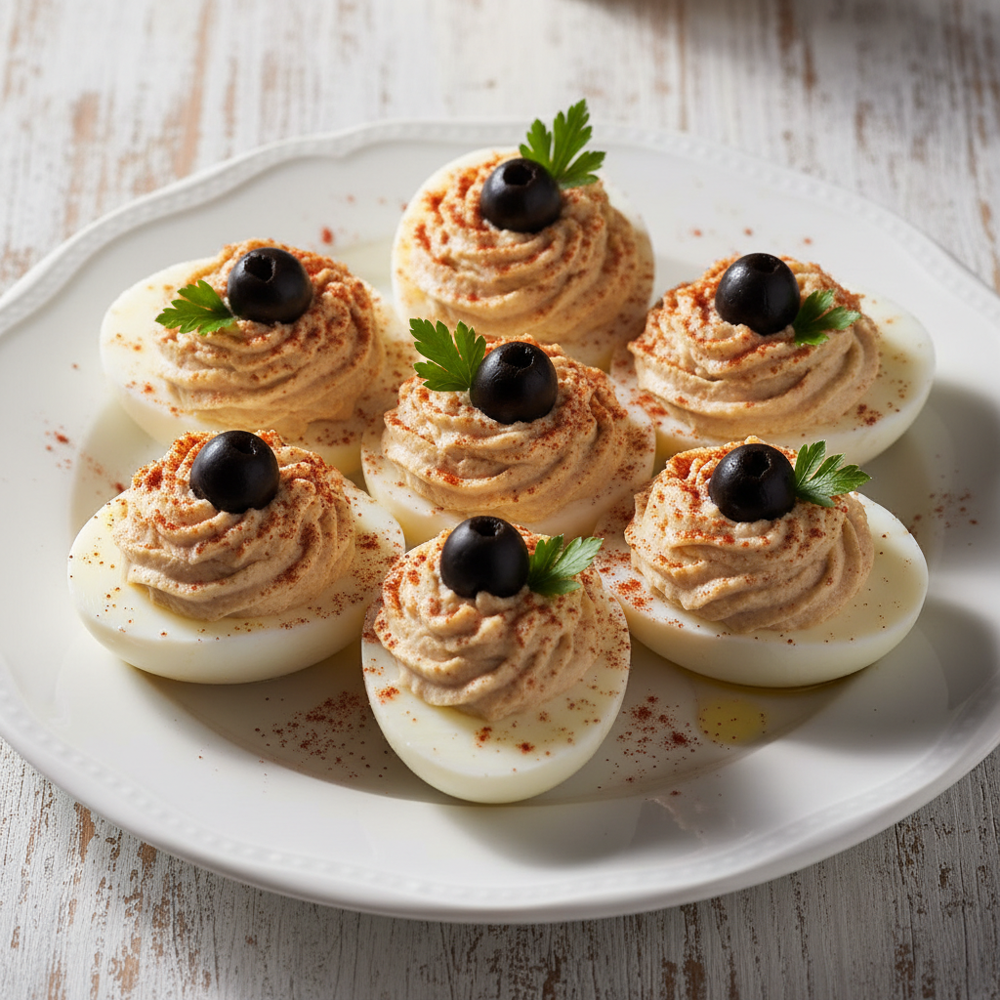

# Huevos Rellenos Clásicos

Un imprescindible de la cocina de tapas española. La cremosidad de la yema emulsionada con atún y mayonesa conquista por su sencillez y elegancia.

**Tiempo:** 30 min | **Comensales:** 6 pax (12 mitades)

## Ingredientes

* 6 huevos frescos (talla L)
* 160g de atún en aceite de oliva (escurrido)
* 80g de mayonesa casera o de calidad
* 2 filetes de anchoa en aceite (opcional, para intensidad)
* 1 cucharadita de mostaza de Dijon
* Sal y pimienta blanca molida
* Pimentón dulce de La Vera (para decorar)
* Aceitunas negras sin hueso (para decorar)
* Perejil fresco picado
* Vinagre blanco (para la cocción)

## Elaboración

1. Cocer los huevos: Coloca los huevos en agua fría con una cucharada de vinagre y sal. Lleva a ebullición y cocina exactamente 10 minutos desde que rompa el hervor.
2. Inmediatamente tras la cocción, sumergir los huevos en agua helada durante 5 minutos (choque térmico). Esto facilita el pelado y evita el halo verdoso alrededor de la yema.
3. Pelar con cuidado y cortar cada huevo longitudinalmente por la mitad. Extraer las yemas con delicadeza y reservar las claras.
4. En un bol, desmenuzar el atún y mezclarlo con las yemas. Añadir la mayonesa, la mostaza, las anchoas picadas finamente y trabajar con un tenedor hasta obtener una pasta cremosa y homogénea.
5. Rectificar de sal y pimienta blanca. La textura debe ser untuosa pero firme para poder rellenar.
6. Con una manga pastelera (o dos cucharillas), rellenar generosamente cada mitad de clara formando un copete.
7. Decorar con un toque de pimentón, media aceituna negra y perejil picado.

## Notas del Chef

* **Truco:** Para que las yemas queden perfectamente centradas (y las claras simétricas al rellenar), durante los primeros 3 minutos de cocción, remueve suavemente los huevos en el agua con una cuchara de madera.
* **Presentación:** SIEMPRE con el relleno hacia arriba. La clara actúa como "barquita" que sostiene el relleno coronado con la decoración.
* **Errores comunes:** Sobrecocción (más de 11 min) genera yemas secas y verdosas. Insuficiente mayonesa hace un relleno quebradizo que no mantiene la forma.
* **Variaciones:** Versión con bacalao desalado, con gambas cocidas picadas, o con piquillo y brandada para un toque más gourmet.
* **Maridaje:** Manzanilla bien fría o un fino de Jerez. También encaja con un albariño joven si se sirve como entrante.
